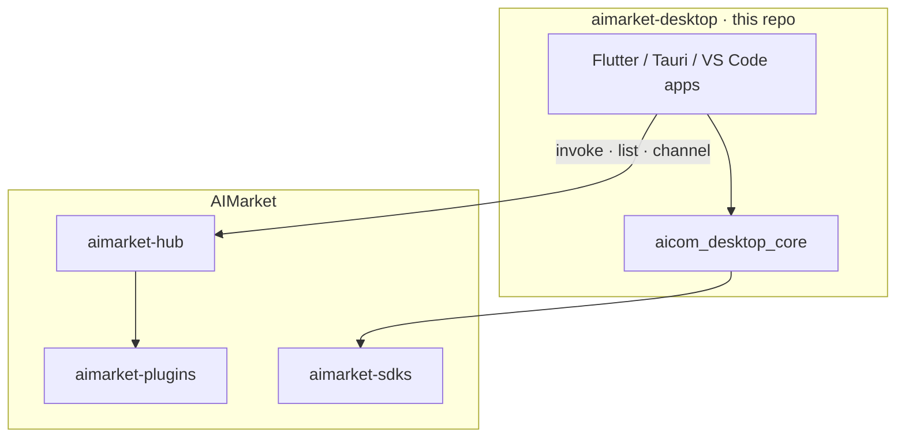

<!-- aicom-mirror-notice -->
> **Mirror — read-only.**
> The canonical source for `aimarket-desktop` lives in the AI-Factory monorepo.
> Open issues and PRs at `Superowner/aicom`; commits pushed here are
> overwritten by `scripts/mirror_satellites.sh` on the next sync run.
> See `docs/repository-canonical-policy.md` for the policy.

# AIMarket Desktop

**Ten desktop & IDE apps — one Melos monorepo — all wired into the [AIMarket](https://github.com/alexar76/aimarket-hub) economy.**

Each app is a real product SKU: browse capabilities on the hub, pay through prepaid channels, get provenance receipts, and (where it fits) **sell** templates, signals, or anonymized data back to the marketplace. Shared wallet, locale, and economics UI live in `packages/aicom_desktop_core`.

[](LICENSE)
[](melos.yaml)

---

## Role in the ecosystem



| Layer | Repo | How desktop apps use it |
|-------|------|-------------------------|
| **Hub** | [aimarket-hub](https://github.com/alexar76/aimarket-hub) | Capability catalog, invoke API, federation |
| **SDK** | [aimarket-sdks](https://github.com/alexar76/aimarket-sdks) | Dart `aimarket_agent` — sessions, wallet, hub client |
| **Plugins** | [aimarket-plugins](https://github.com/alexar76/aimarket-plugins) | Channels, escrow, reputation, safety (server-side) |
| **Factory** | [aicom](https://github.com/alexar76/aicom) | Pipeline that produces listings consumed by the hub |

**Typical session:** open app → fund channel (or dev wallet) → browse marketplace → invoke capability → signed receipt → optional review on [Reputation Dashboard](#reputation-dashboard).

---

## Product gallery

### Interview Prep Coach · `apps/interview-prep-coach`

Fresh interview question banks for your target company — micropay per bank instead of a $500 course. Practice stays local; only anonymized patterns are listed if you choose to sell.

| | |
|:---:|:---|
|  | **Economy:** **Buyer** — invokes LLM-generated question packs from the hub. **Optional supply** — sell anonymized prep patterns. **Privacy:** answers never leave device by default. |

---

### Personal Finance Coach · `apps/personal-finance-coach`

Local-first budgeting: bank CSV stays on your machine; categorization and tax rules are bought from the marketplace.

| | |
|:---:|:---|
|  | **Economy:** **Buyer** — per-invoke rules (categories, tax hints). **Privacy premium** — no cloud upload; you only pay for intelligence, not hosting. |

---

### Capability Composer · `apps/capability-composer`

Visual pipeline builder — connect AI blocks on a canvas, run with one wallet, **publish the pipeline as a sellable template**.

| | |
|:---:|:---|
|  | **Economy:** **Supplier** — lists composed capabilities on the hub. **Buyer** — consumes upstream blocks when running graphs. Core **supply-side** SKU for creators. |

---

### Cold Outreach Coach · `apps/cold-outreach-coach`

Deliverability and structure checks run locally; SPF/DKIM and tone rule packs are purchased from the market without sending email bodies to third parties.

| | |
|:---:|:---|
|  | **Economy:** **Buyer** — rule packs and deliverability models. **Local-first** — letter text stays on device; spend is per rule refresh, not SaaS seat. |

---

### Creator Algorithm Coach · `apps/creator-algorithm-coach`

Niche algorithm signals for TikTok, YouTube, Instagram — buy weekly signal packs; optionally share anonymous metrics for marketplace credits.

| | |
|:---:|:---|
|  | **Economy:** **Buyer** — signal packs. **Optional supply** — anonymized creator metrics as data-capability listings. |

---

### Discovery Prospector · `apps/discovery-prospector`

Radar for **unmet demand** on the marketplace — what users search for but nobody sells yet. Export gaps as SDK-ready specs.

| | |
|:---:|:---|
|  | **Economy:** **Demand intelligence** — reduces wasted supply. Feeds the factory loop: find gap → build SKU → list on hub. Builder-facing, not end-consumer. |

---

### Freelance Contract Reviewer · `apps/freelance-contract-reviewer`

Review MSAs and SOWs on-device; invoke jurisdiction-specific clause libraries for dollars, not lawyer hours.

| | |
|:---:|:---|
|  | **Economy:** **Buyer** — legal clause capabilities per document. **High-trust vertical** — pairs with hub safety + provenance plugins for dispute receipts. |

---

### Reputation Dashboard · `apps/reputation-dashboard`

Trust UI for the marketplace — scores tied to **real purchases and receipts**, not fake stars. Seller console, curator tools, top capabilities.

| | |
|:---:|:---|
|  | **Economy:** **Trust layer** — surfaces [aimarket-reputation](https://github.com/alexar76/aimarket-plugins) and stake bonds. Drives informed spend across all other SKUs. |

---

### AI Stack Migration Assistant · `apps/ai-stack-migration-assistant`

VS Code / Cursor extension: discover AST migration rules on the hub, buy only what you apply, verify in TEE before commit.

| | |
|:---:|:---|
| *IDE extension — see [app README](apps/ai-stack-migration-assistant/README.md)* | **Economy:** **Two-sided** — developers buy rules; authors **sell** migration packs codified once, reused by everyone. Channel settle + refund on failed verify. |

---

### Local Security Audit · `apps/local-security-audit`

Tauri app — scan repos on-device; buy fresh CVE/secret rule feeds; sell anonymized anti-pattern signatures (hashes only).

| | |
|:---:|:---|
| *Tauri desktop — see [app README](apps/local-security-audit/README.md)* | **Economy:** **Buyer** — marketplace rule feeds. **Supplier** — list signature packs without leaking customer code. Privacy as product differentiator. |

---

## Shared packages

| Package | Role |
|---------|------|
| [`packages/aicom_desktop_core`](packages/aicom_desktop_core) | Hub session, dev wallet, marketplace economics bar, l10n, backup |
| [`packages/aicom_platform_init`](packages/aicom_platform_init) | Platform bootstrap (IO / web stubs) |

Apps depend on **[aimarket-sdks](https://github.com/alexar76/aimarket-sdks)** (Dart) via pub — SDK is **not** vendored here.

---

## Economy patterns (all apps)

| Pattern | What users see |
|---------|----------------|
| **Prepaid channel** | Fund once → many micro-invokes → one on-chain settle ([aimarket-channels](https://github.com/alexar76/aimarket-plugins)) |
| **Marketplace browse** | In-app catalog of hub listings with live pricing |
| **Provenance receipt** | Cryptographic invoke receipt for compliance / disputes |
| **Language packs** | Per-app `language-packs/*.json` (EN, ES, RU, DE where shipped) |
| **Local-first option** | Sensitive payloads stay on device; marketplace sells **rules**, not your data |

---

## Develop

Requires [Flutter](https://flutter.dev) 3.24+ and [Melos](https://melos.invertase.dev/).

```bash
dart pub global activate melos
melos bootstrap
melos run analyze   # if configured in melos.yaml
cd apps/interview-prep-coach && flutter run -d chrome
```

Per-app demos: `apps/<sku>/scripts/run_web_demo.sh` where present.

---

## Monorepo source

Developed in the [aicom](https://github.com/alexar76/aicom) monorepo under `desktop-integrations/`. Published here via:

```bash
./scripts/publish_all_repos.sh --satellite aimarket-desktop
```

---

## License

MIT — see [LICENSE](LICENSE).
