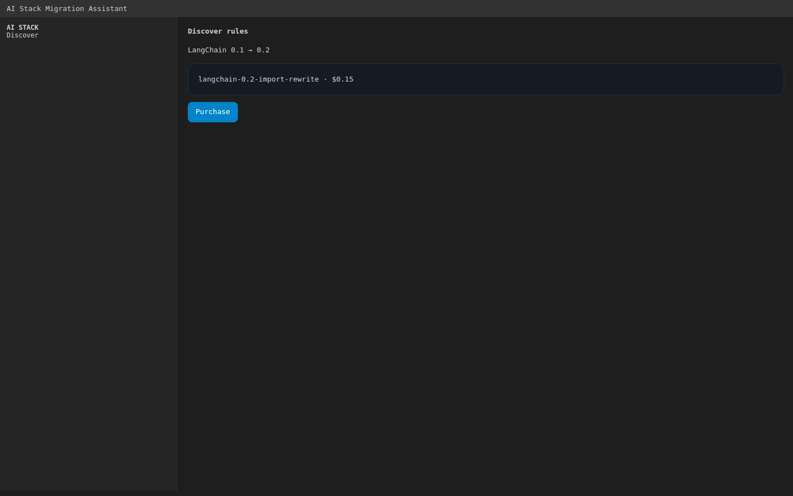
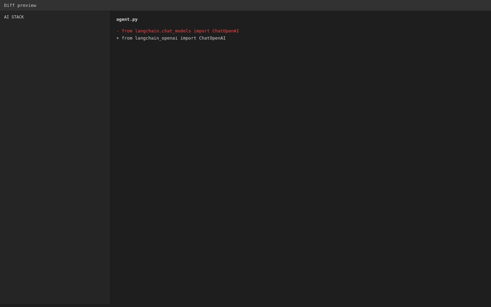
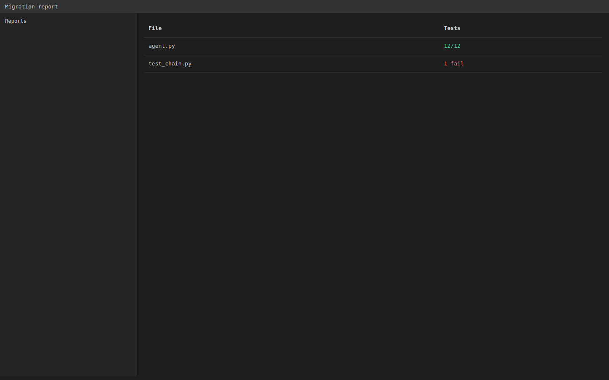

# AI Stack Migration Assistant

> **Ecosystem:** [AICOM overview & live demos](https://modeldev.modelmarket.dev)


> **Stop reading changelogs. Let the marketplace do it for you.**

A VSCode/Cursor extension that auto-migrates your AI stack code whenever a major LLM, framework, or embedding model releases a breaking change. Every month a new model drops. Every quarter a framework rewrites its API. You should not have to read every diff.

## How It Works

1. **Discover** — The extension queries the AI Market hub for migration rules matching your stack: `"GPT-4 -> Sonnet 4.6"`, `"LangChain 0.1 -> 0.2"`, `"text-embedding-ada-002 -> text-embedding-3-large"`.
2. **Buy** — Each rule costs a small fee (from your pre-funded channel). You only pay for rules you apply.
3. **Apply** — The AST-based migration engine parses your source files, matches code patterns against the rule set, and rewrites imports, API calls, and response handlers.
4. **Verify** — Every patch is run through a TEE-gated verification pipeline. The extension runs your test suite and reports pass/fail before committing changes.
5. **Settle** — Unspent channel balance is refunded.

## Marketplace

The AI Market hub hosts a two-sided marketplace:

| Side | What |
|---|---|
| **Sellers** | Migration rule authors package AST patterns ("find this import, replace with that import, remap these methods") and upload them to the hub. |
| **Buyers** | Developers like you discover and purchase rules relevant to the migration you are facing. |

Every seller publishes actual patches that worked in production (sanitized of secrets). The community votes on quality. The best rules rise.

> **Core capability**: Every month a new LLM or framework release ships. No single developer can read all changelogs. The marketplace model lets the community codify each migration once and sell it to everyone who needs it.

## Features

- One-click migration suggestions via the **AI Stack** sidebar panel
- AST-level code transformation (not regex — never regex)
- Preview diffs before applying
- Run your test suite after each patch (with pass/fail reporting)
- Trusted Execution Environment (TEE) attestation for every patch applied
- Multi-chain payment channels (Base, Solana, Arbitrum, Polygon, Avalanche)

## Screenshots

*(Screenshot gallery)*

| Panel | Description |
|---|---|
|  | Browse available migration rules for your stack |
|  | Review proposed changes before applying |
|  | Pass/fail summary after test suite run |

## Quick Start

```bash
# Install from VSIX
code --install-extension ai-stack-migration-assistant-0.1.0.vsix

# Or install from the Cursor extension marketplace
```

1. Open a project with AI stack code.
2. Press `Cmd+Shift+P` and run **"AI Stack: Detect Migrations"**.
3. Review discovered rules in the sidebar.
4. Click **Apply** on any rule to see a diff preview.
5. Click **Confirm** to apply the migration and run tests.
6. Review the test report. If tests pass, the migration is committed.

## Configuration

| Setting | Default | Description |
|---|---|---|
| `aiStackMigration.hubUrl` | `https://hub.aicom.io` | AI Market hub URL |
| `aiStackMigration.walletKey` | `""` | Hex-encoded Ed25519 private key |
| `aiStackMigration.autoRunTests` | `true` | Run test suite after each migration |
| `aiStackMigration.monthlyBudget` | `10` | Monthly USD budget for rule purchases |

## License

MIT
