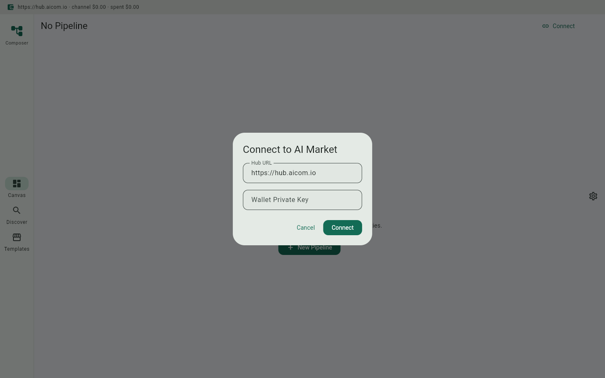
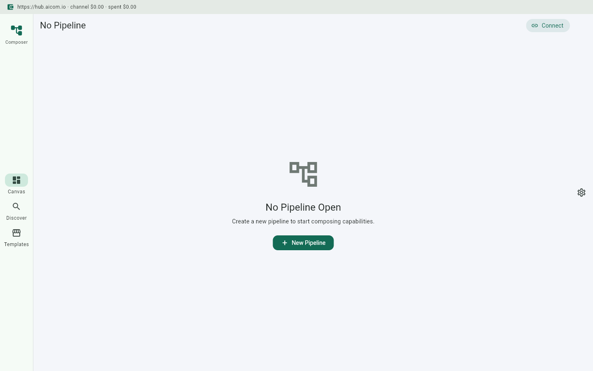

# Capability Composer

> **Ecosystem:** [AICOM overview & live demos](https://alexar76.github.io/aicom/)

**Desktop pipeline builder for the AI Market Protocol — Zapier for aimarket.**

Capability Composer is a Flutter desktop app (macOS / Windows / Linux) that lets you visually discover, chain, and sell AI capabilities from the [AI Market Protocol](https://github.com/alexar76/aimarket) marketplace. It is the Tier 4 meta-product that makes the economy itself more usable.

## Promo video

Watch the product walkthrough (Playwright capture from factory pipeline):

- **Latest clip:** [`docs/gallery/promo-latest.webm`](../docs/gallery/promo-latest.webm) *(generated on shipped builds)*
- **Record locally:** `./scripts/run_web_demo.sh` then open Admin → Demo Storefront

## Screenshot gallery

| | | | |
|---|---|---|---|
|  |
|  |
|  |
|  |

Full gallery: **[assets/screenshots/](assets/screenshots/)**

Screenshots are captured during QA sign-off. Replace placeholders in `assets/screenshots/` with real captures from `./scripts/capture_screenshots.sh`.

---

## Screenshots

| Pipeline Canvas | Capability Browser | Marketplace |
|----------------|-------------------|-------------|
| *(screenshot)* | *(screenshot)*   | *(screenshot)* |

---

## Why Capability Composer?

The AI Market Protocol has thousands of individual capabilities — ATS scorers, cold email generators, CRM loggers, security scanners, trend detectors, and more. Each is powerful alone, but **pipelines** are where the real value lives.

Capability Composer lets you:

- **Buy** individual capabilities from the marketplace
- **Chain** them visually with a drag-and-drop node graph editor
- **Sell** the resulting pipelines as packaged products on the marketplace
- **Run** pipelines on a schedule, via webhook, or on-demand

This is a **meta-product**: it doesn't compete with capability sellers. It grows their market by making their offerings composable and discoverable through successful pipeline templates.

---

## Quick Start

```bash
# Clone and enter
cd capability-composer

# Get dependencies
flutter pub get

# Run (macOS)
flutter run -d macos

# Run (Linux)
flutter run -d linux

# Run (Windows)
flutter run -d windows
```

### First Pipeline

1. Launch the app and connect your wallet
2. Click **New Pipeline**
3. Search for capabilities by intent (e.g., "LinkedIn profile analysis")
4. Drag capabilities onto the canvas
5. Connect outputs to inputs
6. Click **Run** to execute the pipeline
7. Click **Publish** to sell the pipeline template

---

## Features

### Visual Node Graph Editor
- Drag-and-drop capabilities onto an infinite canvas
- Draw edges between output ports and input ports
- Auto-layout and snap-to-grid
- Zoom, pan, minimap

### Capability Discovery
- Search by natural language intent
- Filter by category, price range, trust score, latency
- Compare capabilities side-by-side
- View input/output schemas inline

### Pipeline Execution Engine
- Execute pipelines step-by-step with live output preview
- Parallel execution for independent branches
- Retry, timeout, and error handling per node
- Cost estimation before execution

### Pipeline Templates Marketplace
- Publish your pipelines as purchasable templates
- Browse and buy templates from other creators
- Clone and customize any template
- Revenue share with upstream capability sellers

### Wallet Integration
- Multi-chain support (Base, Polygon, Arbitrum, Optimism, Ethereum)
- Pre-funded payment channels for fast execution
- One-click settlement and refunds
- Transaction history and receipts

---

## Architecture Overview

```
┌─────────────────────────────────────────────┐
│           Capability Composer                │
│  ┌─────────┐  ┌──────────┐  ┌────────────┐  │
│  │ Pipeline │  │ Capability│  │ Marketplace│  │
│  │  Canvas  │  │  Browser  │  │  Templates │  │
│  └────┬─────┘  └────┬─────┘  └─────┬──────┘  │
│       │              │               │         │
│  ┌────┴──────────────┴───────────────┴──────┐  │
│  │         Pipeline Execution Engine         │  │
│  └────────────────┬─────────────────────────┘  │
│                   │                             │
│  ┌────────────────┴─────────────────────────┐  │
│  │         aimarket_agent Dart SDK           │  │
│  └────────────────┬─────────────────────────┘  │
└───────────────────┼────────────────────────────┘
                    │
         ┌──────────┴──────────┐
         │   AI Market Hub     │
         │  (hub.aicom.io)     │
         └─────────────────────┘
```

See [docs/architecture.md](docs/architecture.md) for detailed design.

---

## User Stories

| Role | Pipeline | Benefit |
|------|----------|---------|
| **Recruiter** | LinkedIn analysis -> cold email -> CRM logging | 10x candidate outreach throughput |
| **Developer** | Code review -> security scan -> deploy check | Automated CI/CD quality gate |
| **Marketer** | Trend detection -> content generation -> scheduling | Always-on content pipeline |

See [docs/user-cases.md](docs/user-cases.md) for full walkthroughs.

---

## SDK Integration

Capability Composer is built on the [`aimarket_agent`](https://github.com/alexar76/aimarket-sdks/tree/main/dart) Dart SDK. See [docs/sdk-integration.md](docs/sdk-integration.md) for multi-capability orchestration examples.

```dart
final agent = AimarketAgent(hubUrl: 'https://hub.aicom.io', walletKey: key);

// Discover pipeline components
final linkedin = await agent.discover(intent: 'LinkedIn profile analysis', category: 'career');
final email = await agent.discover(intent: 'cold email generation', category: 'career');
final crm = await agent.discover(intent: 'CRM contact creation', category: 'productivity');

// Chain: linkedin.output -> email.input, email.output -> crm.input
```

---

## Development

```bash
# Run tests
flutter test

# Analyze
flutter analyze

# Build for production
flutter build macos --release
flutter build linux --release
flutter build windows --release
```

---

## License

Proprietary — see [LICENSE](../LICENSE) in the monorepo root.
