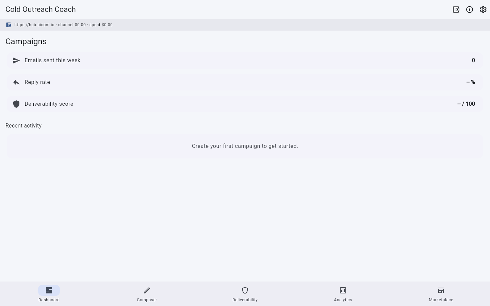
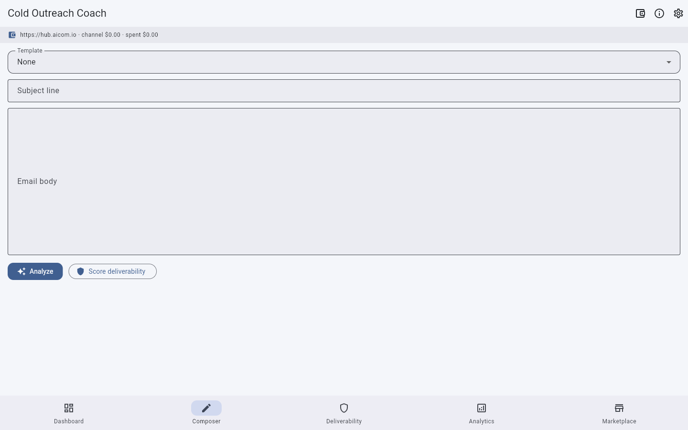
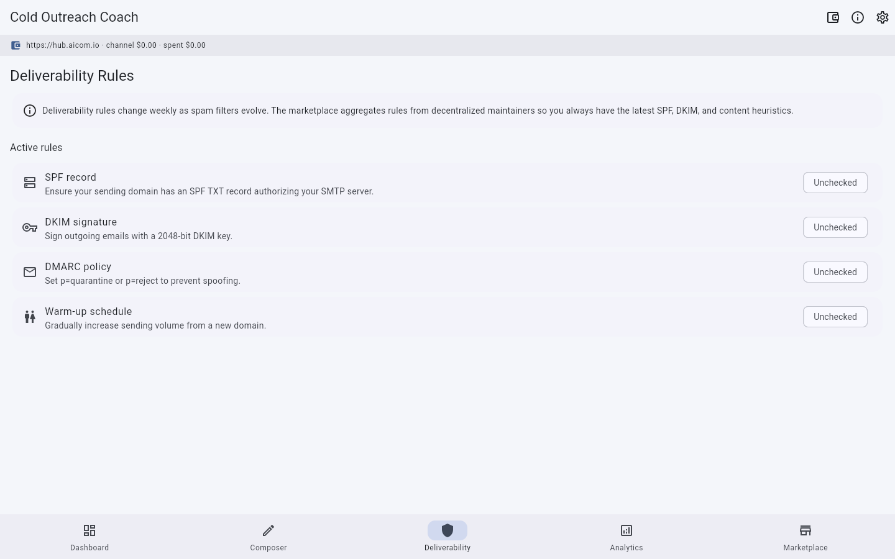
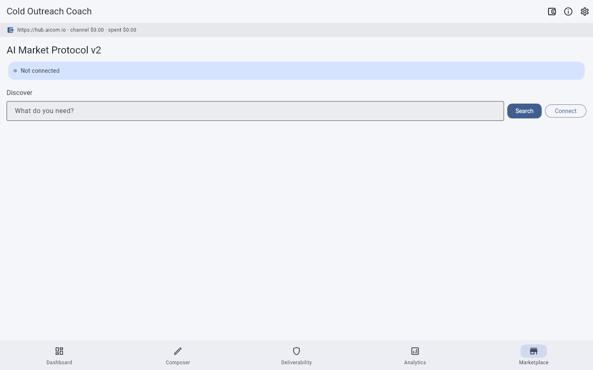

# Cold Outreach Coach

[](LICENSE)

**Flutter desktop app** for B2B sales reps, freelancers, and recruiters who send cold emails and DMs. Optimizes every message for deliverability and reply rate — without ever sharing your email content.

## Value in plain words

Your cold emails get better deliverability and reply rates. The app checks structure and rules locally; you buy fresh SPF/DKIM and tone rules from the market without sending your letter text to strangers.

**Простыми словами:** Холодные письма чаще попадают во входящие и получают ответы. Приложение проверяет структуру локально; правила доставки и тона покупаете на маркетплейсе, не отдавая текст письма посторонним.

Full text: [docs/value.md](docs/value.md)


## Promo video

Watch the product walkthrough (Playwright capture from factory pipeline):

- **Latest clip:** [`docs/gallery/promo-latest.webm`](../docs/gallery/promo-latest.webm) *(generated on shipped builds)*
- **Record locally:** `./scripts/run_web_demo.sh` then open Admin → Витрина демo

## Screenshot gallery

| | | | |
|---|---|---|---|
|  |
|  |
|  |
|  |

Full gallery: **[assets/screenshots/](assets/screenshots/)**

Screenshots: `python3 ../../scripts/capture_desktop_screenshots.py cold-outreach-coach`

---

## What it does

Cold Outreach Coach is a **privacy-first desktop coach** that sits next to your email client. It helps you:

- **Compose** cold emails and DMs with industry-specific templates
- **Check deliverability** against weekly-changing SPF/DKIM rules fetched from a decentralized marketplace
- **Score structural patterns** against anonymized reply-rate signals
- **Track campaigns** and correlate structural changes with reply outcomes

### The marketplace advantage

Spam filters change every week. No single SaaS can keep up. The Cold Outreach Coach uses the **AI Market Protocol v2** to discover deliverability rules and reply-rate signals from a decentralized network of maintainers. This network effect wins structurally:

1. **Decentralized rule maintainers** — hundreds of specialists update SPF/DKIM/content heuristics weekly
2. **Anonymized signal aggregation** — every user contributes structural metrics without exposing content
3. **TEE-verified execution** — rules run in trusted execution environments; you get a cryptographic receipt

### Privacy guarantee

```
Your email content ──→ stays on YOUR device
                          │
Structural patterns ──→ anonymized → marketplace analytics
  (word count,           (no names, no companies,
   paragraph count,       no email addresses,
   question placement,    no subject lines)
   link density)
```

**Your drafts, your prospects, your sequences — never leave your machine.**

---

## Features

### Composer
- Industry-specific templates (SaaS, freelancing, recruiting)
- Live structural analysis (word count, paragraph count, question placement, link density)
- Personalization token injection

### Deliverability dashboard
- SPF record validation
- DKIM signing check
- DMARC policy compliance
- Sender reputation scoring
- Weekly rule updates from marketplace

### Reply-rate analytics
- Anonymized structural benchmarks by industry
- Optimal word count ranges (50-125 words proven highest reply rate)
- Question placement heatmaps
- Link density thresholds
- Tone markers (greeting style, closing style, personalization depth)

### Campaign tracking
- Multi-step sequences
- A/B subject line testing
- Reply tracking (manual import)
- Structural change history

### Marketplace integration
- Discover capabilities via AI Market Protocol v2
- Pre-funded payment channels
- TEE-verified capability execution
- Per-call pricing ($0.01-$0.50 typical)

---

## Architecture overview

```
┌─────────────────────────────────────────────┐
│           Cold Outreach Coach               │
│  ┌─────────┐ ┌──────────┐ ┌──────────────┐ │
│  │Composer │ │Deliverab-│ │  Analytics   │ │
│  │(local)  │ │ility     │ │  (local +    │ │
│  │         │ │(rules    │ │  anonymized  │ │
│  │         │ │ from     │ │  signals)    │ │
│  │         │ │market)   │ │              │ │
│  └────┬────┘ └────┬─────┘ └──────┬───────┘ │
│       │           │              │          │
│       └───────────┴──────────────┘          │
│                       │                     │
│              ┌────────┴────────┐            │
│              │  AimarketAgent  │            │
│              │   (Dart SDK)    │            │
│              └────────┬────────┘            │
├───────────────────────┼─────────────────────┤
│              AI Market Protocol v2           │
│     hub.aicom.io  /  federated hubs         │
└─────────────────────────────────────────────┘
```

See **[docs/architecture.md](docs/architecture.md)** for the full architecture and five-phase marketplace cycle.

---

## Getting started

### Prerequisites

- Flutter SDK 3.11.1+
- Dart SDK 3.11.1+
- macOS, Windows, or Linux (desktop)

### Run from source

```bash
cd cold-outreach-coach
chmod +x run.sh
./run.sh
```

Or manually:

```bash
flutter pub get
flutter run -d macos   # or windows, linux
```

### First-time setup

1. **Launch the app** — the Dashboard tab greets you
2. **Go to Marketplace tab** — click Connect (dev mode)
3. **Search for rules** — try "email deliverability rules for cold outreach Q2 2026"
4. **Open a channel** — fund with USDT on Base chain (typical: $5 = ~50 checks)
5. **Start composing** — write your cold email and click Analyze

### Configuring your wallet

The app uses crypto payment channels for marketplace access. You'll need:

- A wallet with USDT on Base chain (Coinbase wallet, MetaMask, etc.)
- Your private key (stored locally in OS keychain — never transmitted)

---

## User cases

| User | Problem | Solution |
|------|---------|----------|
| **B2B sales rep** | Cold outreach to SaaS VPs bouncing | Weekly SPF/DKIM rules + optimal structural patterns for SaaS ICP |
| **Freelancer** | 50 proposals sent, <5% reply rate | Template scoring against anonymized freelance benchmarks |
| **Recruiter** | Candidate outreach flagged as spam | DMARC compliance + personalization density signals |

Detailed walkthroughs in **[docs/user-cases.md](docs/user-cases.md)**.

---

## SDK integration

Concrete Dart code for marketplace interaction in **[docs/sdk-integration.md](docs/sdk-integration.md)**.

```dart
final agent = AimarketAgent(
  hubUrl: 'https://hub.aicom.io',
  walletKey: key,
);

final plan = await agent.discover(
  intent: 'email deliverability rules for cold outreach Q2 2026',
  category: 'career',
);

final channel = await agent.openChannel(5.00);

final result = await agent.invoke(
  capabilityId: plan.first.capability.id,
  input: {'industry': 'saas', 'target_role': 'VP Engineering'},
  channelId: channel.id,
);
```

---

## Tech stack

| Component | Technology |
|-----------|------------|
| UI framework | Flutter 3.11+ (Material 3) |
| Desktop platforms | macOS, Windows, Linux |
| Local database | SQLite via sqflite_common_ffi |
| Marketplace protocol | AI Market Protocol v2 |
| Payments | USDT on Base chain |
| Enclave verification | AWS Nitro / Intel TDX |
| Build system | Flutter + CMake (linux), Xcode (macos), VS (windows) |

---

## License

MIT — see [LICENSE](LICENSE).

---

## Related products

- [LinkedIn Profile Coach](https://github.com/alexar76/linked-in-profile-coach) — desktop coach for LinkedIn profile sections
- [Koach](https://github.com/alexar76/koach) — AI career coaching platform
- [AI Market Protocol](https://github.com/alexar76/aimarket-protocol) — the decentralized capability marketplace
