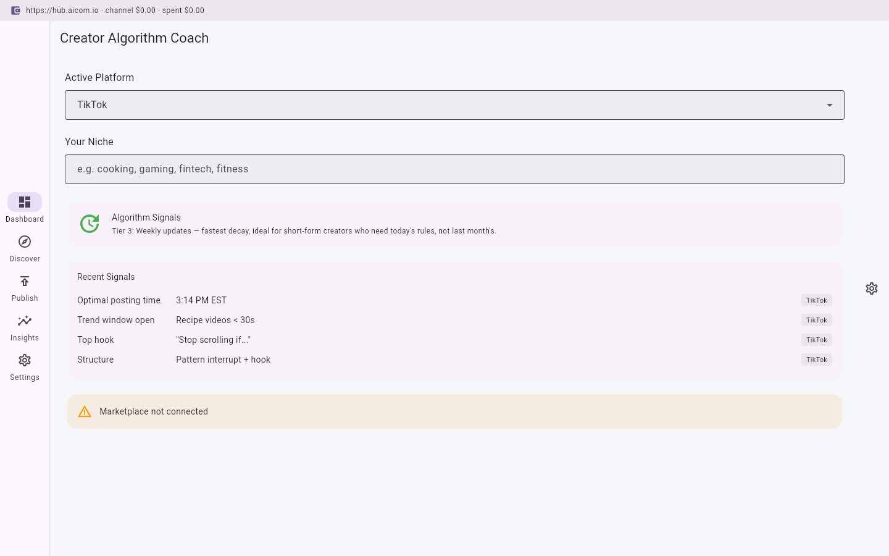
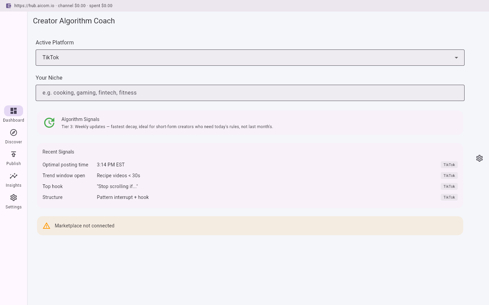

# Creator Algorithm Coach

> **Ecosystem:** [AICOM overview & live demos](https://modeldev.modelmarket.dev)

[](LICENSE)

**Flutter desktop app** for TikTok, YouTube, Instagram, and X/Twitter algorithm optimization. Buys weekly-updated algorithm signals by platform, trend windows, and optimal posting times by niche. Sells verified hook/structure conversion data backed by TEE-proven metrics.

## The Problem

**Algorithms change in days. No SaaS can keep up.**

A TikTok creator's optimal posting window shifts overnight. YouTube's recommendation weights recalculate mid-campaign. Instagram deprioritizes a format you were scaling. By the time a centralized SaaS dashboard reflects the change, your content has already underperformed for a week.

## The Solution

**Marketplace architecture wins structurally.**

Instead of a centralized team maintaining a stale database of "best practices," the Creator Algorithm Coach sources algorithm signals from a decentralized marketplace where:

- **Specialists per platform** feed real-time capability data
- **TEE attestation** proves metrics are genuine — no faking engagement data
- **Tier 3 decay** means data refreshes weekly (fastest decay tier, ideal for short-form creators)
- **You buy what you need** — per-platform, per-niche, per-signal

## Promo video

- **Latest clip:** _promo clip is generated on shipped builds_
- **Record locally:** `./scripts/run_web_demo.sh`

## Screenshot gallery

| | | | |
|---|---|---|---|
|  |
|  |
|  |
|  |

Capture: `python3 ../../scripts/capture_desktop_screenshots.py creator-algorithm-coach`

---

## Features

- **Dashboard** — Active platform selector, niche input, algorithm freshness indicator, recent signals preview, marketplace connection status
- **Discover** — Browse and purchase algorithm signal capabilities from the AI Market: optimal posting times, trend windows, hook/structure benchmarks, algorithm shift detector
- **Publish & Sell** — Upload your own verified creator metrics and earn when other creators buy them
- **Insights** — Algorithm shift timeline across platforms, signal purchase history with TEE verification receipts
- **Settings** — Wallet connection, platform preferences, weekly budget, Tier 3 data decay configuration

## Data Tier: Tier 3 (Fastest Decay)

| Tier | Update Frequency | Best For | Price Range |
|------|------------------|----------|-------------|
| Tier 3 | Weekly | Short-form creators, trend chasers | \$0.10–\$0.30/call |

Tier 3 data decays fastest because algorithm signals have the shortest shelf life. What worked on TikTok on Monday may be obsolete by Friday. The marketplace prices this decay into every call — you pay less for data that expires sooner.

## Architecture

```
┌─────────────────────────────┐
│  Creator Algorithm Coach     │  Flutter Desktop (macOS/Win/Linux)
│  ┌───────────────────────┐  │
│  │  Signal Aggregator     │  │  Combines platform + niche signals
│  ├───────────────────────┤  │
│  │  Market SDK (Dart)     │  │  aimarket_agent package
│  ├───────────────────────┤  │
│  │  TEE Verifier          │  │  Client-side attestation check
│  └───────────────────────┘  │
└──────────┬──────────────────┘
           │ HTTPS / Signed
           ▼
┌─────────────────────────────┐
│  AI Market Hub              │  hub.aicom.io
│  ┌───────────────────────┐  │
│  │  Capability Registry   │  │  Discover + Invoke
│  ├───────────────────────┤  │
│  │  Payment Channels      │  │  Pre-funded, per-session
│  ├───────────────────────┤  │
│  │  TEE Attestation       │  │  AWS Nitro / Intel TDX
│  └───────────────────────┘  │
└──────────┬──────────────────┘
           │
           ▼
┌─────────────────────────────┐
│  Signal Providers            │  Decentralized specialists
│  TikTok Analysts             │  TrendWatchers DAO
│  CreatorDAO                  │  Platform Signals Inc.
└─────────────────────────────┘
```

## Getting Started

### Prerequisites

- Flutter SDK ^3.11.1
- Dart SDK ^3.11.1
- A wallet with USDT on Base chain (for buying signals)

### Installation

```bash
git clone <repo-url>
cd creator-algorithm-coach
flutter pub get
```

### Configuration

1. Open the app and navigate to **Settings**
2. Click **Connect Wallet** and paste your private key
3. Set your preferred platforms and weekly budget
4. Go to **Discover** to browse and purchase algorithm signals

### Running

```bash
flutter run -d macos   # macOS
flutter run -d windows # Windows
flutter run -d linux   # Linux
```

## Marketplace Integration

### Buy Algorithm Signals

```dart
final agent = AimarketAgent(
  hubUrl: 'https://hub.aicom.io',
  walletKey: walletKey,
);

// Discover algorithm signals for TikTok cooking niche
final signals = await agent.discover(
  intent: 'algorithm signals for tiktok cooking - posting times, trend windows',
  budget: 5.00,
  category: 'creator',
);

// Open a payment channel
final channel = await agent.openChannel(5.00);

// Invoke a signal capability
final result = await agent.invoke(
  capabilityId: signals.first.capability.id,
  input: {'platform': 'tiktok', 'niche': 'cooking'},
  channelId: channel.id,
);

// Settle
await agent.closeChannel(channel.id);
```

### Sell Verified Metrics

```dart
final result = await agent.invoke(
  capabilityId: 'sell-metrics-capability-id',
  channelId: channel.id,
  input: {
    'action': 'publish_metrics',
    'metrics': {
      'platform': 'tiktok',
      'niche': 'cooking',
      'avg_watch_time': 23.5,
      'hook_ctr': 0.68,
      'optimal_posting_time': '14:14 EST',
    },
    'tee_attestation': true,
  },
  verifyTee: true,
);
```

## Documentation

- [Architecture](docs/architecture.md) — Platform metrics importer, marketplace SDK, TEE design
- [Use Cases](docs/user-cases.md) — Three real creator scenarios
- [SDK Integration](docs/sdk-integration.md) — Dart code examples with AimarketAgent
- [Contributing](CONTRIBUTING.md) — How to add signal providers
- [Security](SECURITY.md) — TEE verification and wallet safety

## Contributing

See [CONTRIBUTING.md](CONTRIBUTING.md) for development setup and how to add new algorithm signal providers to the marketplace.

## License

MIT
