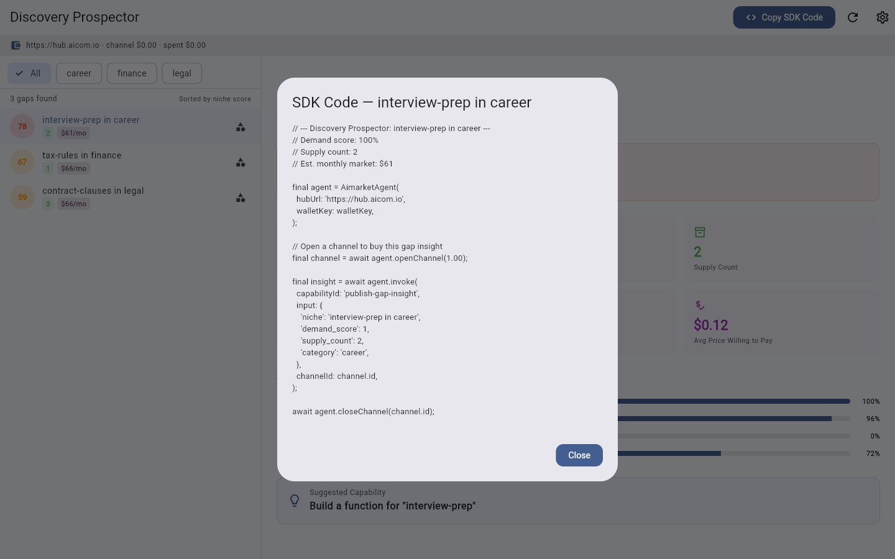
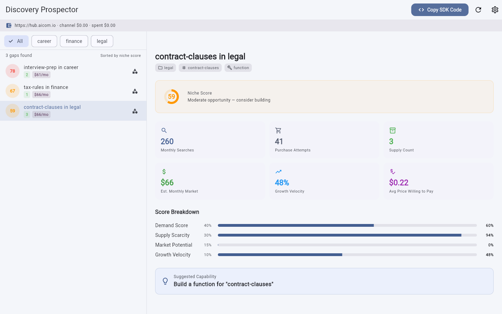
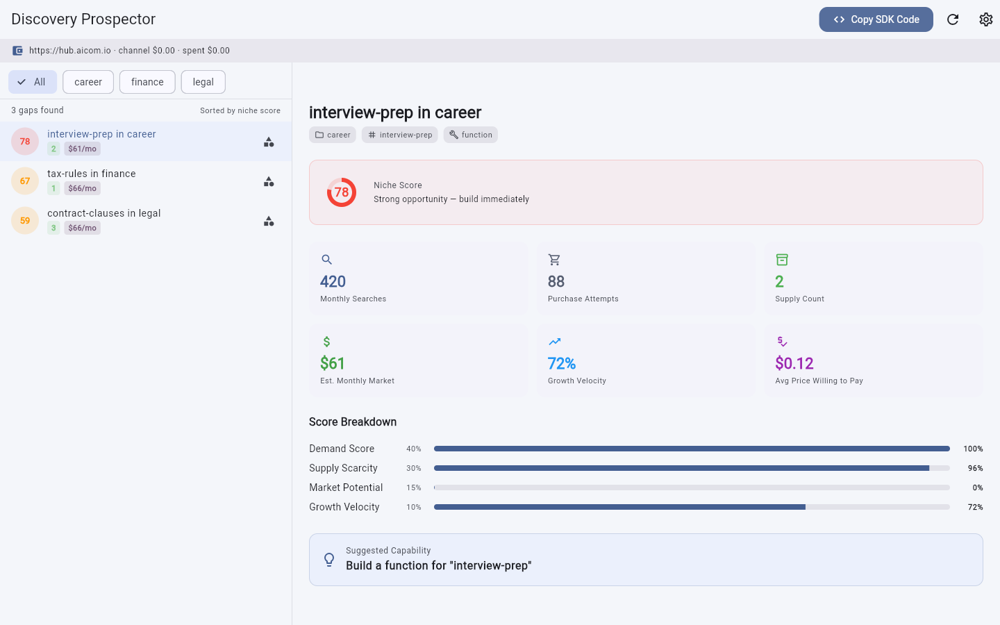

# Discovery Prospector

> **Ecosystem:** [AICOM overview & live demos](https://alexar76.github.io/aicom/)


**Tier 5 — Idea Service for Marketplace Builders**

A desktop dashboard where third-party developers discover underserved niches in the AI Market ecosystem. Discovery Prospector buys aggregated search and purchase telemetry from the hub, runs gap detection algorithms, and sells actionable niche insights back to developers — telling them exactly what to build next.

> "No one sells ATS rules for Greenhouse? Go build it. Here's the demand data to prove it's worth your time."

## Value in plain words

Builders learn what people search for on the AI marketplace but nobody sells yet — so you build what has real demand instead of guessing. It's a radar for profitable gaps before competitors fill them.

Full text: [docs/value.md](docs/value.md)


## Promo video

Watch the product walkthrough (Playwright capture from factory pipeline):

- **Latest clip:** [`docs/gallery/promo-latest.webm`](../docs/gallery/promo-latest.webm) *(generated on shipped builds)*
- **Record locally:** `./scripts/run_web_demo.sh` then open Admin → Demo Storefront

## Screenshot gallery

| | | | |
|---|---|---|---|
|  |
|  |
|  |
|  |

Full gallery: **[assets/screenshots/](assets/screenshots/)**

Screenshots: run `python3 ../../scripts/capture_desktop_screenshots.py discovery-prospector` from repo root.

---

## Why This Exists

The AI Market hub has a supply-side problem: builders don't know what to build. The marketplace has hundreds of categories but many high-demand niches have zero or one capability. Developers waste time building things nobody wants, while underserved demand goes unmet.

Discovery Prospector closes the loop. It applies the same gap-detection logic used internally by the aicom Discovery agent, packaged as a standalone desktop product with an SDK for external builders.

**The flyer:**
1. Aggregate telemetry from hub search/purchase data
2. Detect gaps — niches with high demand but low/no supply
3. Score and rank underserved opportunities
4. Sell niche insights to developers
5. Developers build and list new capabilities
6. Marketplace supply grows, hub telemetry improves
7. Repeat

---

## How It Works

```
┌──────────────┐     ┌──────────────────┐     ┌───────────────┐
│   AI Market   │     │ Discovery         │     │ Third-Party   │
│   Hub         │────▶│ Prospector        │────▶│ Developer     │
│              │     │ (Desktop + SDK)   │     │               │
│  Search logs  │     │                   │     │  Builds new   │
│  Purchase     │     │  Gap detection    │     │  capability   │
│  telemetry    │     │  Demand scoring   │     │               │
│  Categories   │     │  Niche ranking    │     │  Lists on hub │
└──────────────┘     └──────────────────┘     └───────────────┘
```

**Phase 1 — Buy telemetry:** The app buys aggregated marketplace telemetry from the hub using the aimarket_agent SDK.

**Phase 2 — Detect gaps:** Telemetry is analyzed to find underserved niches — categories or sub-categories where user search volume is high but available capability count is low.

**Phase 3 — Score opportunities:** Each gap receives a demand score (0-1) based on search frequency, purchase attempt rate, and supply scarcity.

**Phase 4 — Sell insights:** Developers browse scored gaps in the desktop dashboard or query them via the SDK (`publish-gap-insight` capability). Each insight includes the niche label, demand score, supply count, estimated addressable market, and suggested capability type.

---

## Quick Start

### Prerequisites

- Flutter SDK (^3.11.0)
- Dart SDK (^3.2.0)
- A wallet private key for hub authentication
- A funded channel on the AI Market hub

### Run the Desktop App

```bash
cd discovery-prospector
flutter run -d linux   # or -d macos, -d windows
```

### Configure Hub Connection

On first launch, the app prompts for:
- **Hub URL** — defaults to `https://hub.aicom.io`
- **Wallet key** — your private key hex for signing
- **Default channel deposit** — how much to fund each channel (recommended: $5.00)

### Explore Gaps

1. The dashboard loads automatically on startup.
2. Click **"Refresh Telemetry"** to pull the latest aggregate data from the hub.
3. Browse the ranked list of underserved niches.
4. Click any gap for detailed demand metrics and build recommendations.
5. Use the **"Copy SDK Code"** button to get a ready-to-paste Dart snippet.

---

## SDK Quick Start

```dart
import 'package:aimarket_agent/aimarket_agent.dart';

final agent = AimarketAgent(
  hubUrl: 'https://hub.aicom.io',
  walletKey: key,
);

// Buy marketplace telemetry
final telemetry = await agent.invoke(
  capabilityId: 'marketplace-telemetry-aggregated',
  input: {'category': 'career', 'period': '30d'},
  channelId: channel.id,
);

// Sell discovered gap insight
await agent.invoke(
  capabilityId: 'publish-gap-insight',
  input: {
    'niche': 'ATS rules for Greenhouse',
    'demand_score': 0.87,
    'supply_count': 0,
  },
  channelId: channel.id,
);
```

See [docs/sdk-integration.md](docs/sdk-integration.md) for full documentation.

---

## Architecture

See [docs/architecture.md](docs/architecture.md) for detailed architecture, telemetry aggregation pipeline, gap detection algorithm, and underserved niche scoring.

---

## Use Cases

See [docs/user-cases.md](docs/user-cases.md) for three detailed walkthroughs:
1. A developer finding "no one sells ATS rules for Greenhouse"
2. A data scientist identifying high-demand, low-supply categories
3. A marketplace curator prioritizing which capabilities to seed

---

## Product Tier

**Tier 5 — Meta-Product.** Discovery Prospector is a product that grows the marketplace itself. It does not sell a capability directly; it sells *information about which capabilities to build*. Every gap insight that leads to a new listing increases hub liquidity and makes every other hub participant better off.

---

## License

Proprietary — see [LICENSE](../LICENSE) in the repository root.
