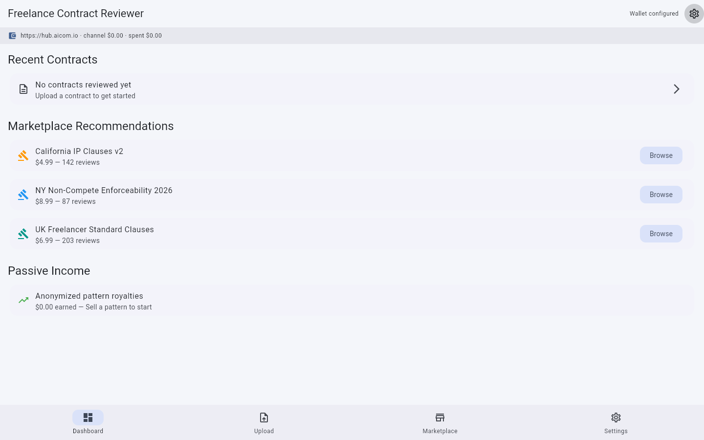
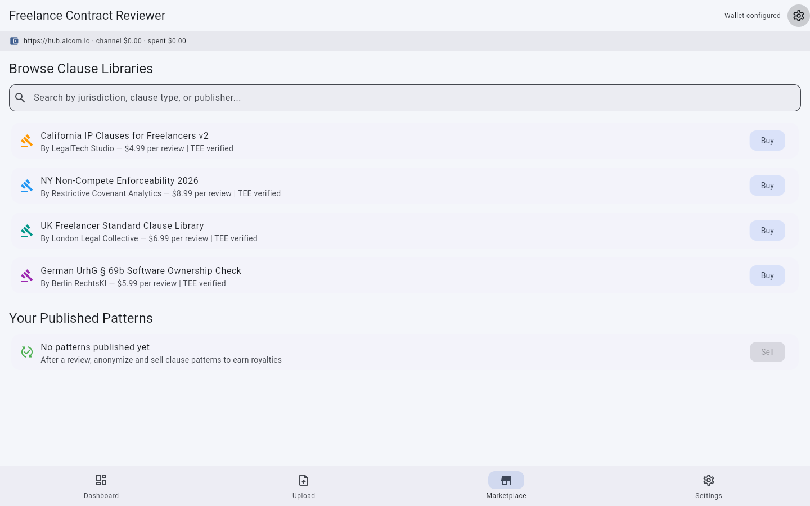
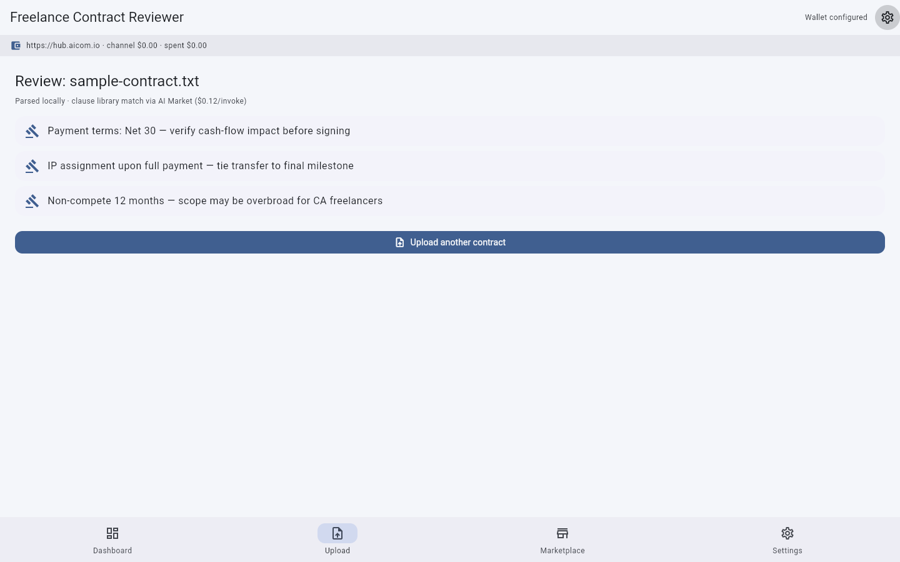

# Freelance Contract Reviewer

> **Ecosystem:** [AICOM overview & live demos](https://alexar76.github.io/aicom/)


**Tier 2 — High privacy value.** Contracts stay on your machine. Period.

A Flutter desktop app (macOS / Windows / Linux) that lets freelancers review client contracts locally, buy jurisdiction-specific clause libraries from the AI Market marketplace, and — if you choose — sell anonymized "which clauses caused disputes" patterns back to the marketplace for passive income.

## Value in plain words

Freelancers read client contracts on their own computer before signing. For a few dollars you invoke jurisdiction-specific clause libraries instead of paying a lawyer hundreds for a simple MSA review.

Full text: [docs/value.md](docs/value.md)


## The killer pitch

> A typical freelancer won't hire a $400/hour lawyer to review a $2,000 contract. But they **will** pay $5 for a marketplace clause-library check that takes 30 seconds.

The Freelance Contract Reviewer makes that $5 check fast, private, and trustable.

## Promo video

Watch the product walkthrough (Playwright capture from factory pipeline):

- **Latest clip:** [`docs/gallery/promo-latest.webm`](../docs/gallery/promo-latest.webm) *(generated on shipped builds)*
- **Record locally:** `./scripts/run_web_demo.sh` then open Admin → Demo Storefront

## Screenshot gallery

| | | | |
|---|---|---|---|
|  |
|  |
|  |
|  |

Full gallery: **[assets/screenshots/](assets/screenshots/)**

Screenshots: `python3 ../../scripts/capture_desktop_screenshots.py freelance-contract-reviewer`

---

## Features

### Private local contract parsing
- Drag-and-drop a PDF or DOCX contract onto the app — **it never leaves your machine**.
- Parsing happens entirely in-process using local NLP. No cloud upload. No API call to parse.
- The app's local database indexes clause types and red-flag keywords with zero network egress.

### Marketplace clause library purchases
- Discover and buy clause libraries from the AI Market marketplace (e.g. "California freelance IP clauses", "UK non-compete enforceability 2026").
- Each library is a curated set of legal rules written by domain experts, delivered as a verified capability.
- Libraries cost $3–$15 depending on jurisdiction depth and update frequency.
- Purchase executes through a pre-funded payment channel — $5 deposit covers a full contract review.

### Dispute pattern selling
- After reviewing, you may choose to **anonymize and sell** the clause pattern you just reviewed.
- The app strips all client/party names, locations, and identifying figures, then submits the abstracted clause pattern — e.g. "an arbitration clause with >30-day notice period in a software development SOW" — to the marketplace.
- Buyers can search dispute patterns to see which clauses actually led to disagreements. Each sold pattern earns you a micro-royalty ($0.10–$1.00).

### TEE-verified rule execution
- Purchased clause libraries run inside a Trusted Execution Environment (TEE) on the marketplace hub.
- Before sending your extracted clauses to the TEE, the app verifies the attestation — proving the code running is exactly the library you bought, running in a secure enclave.
- After review, the TEE receipt proves your clauses were evaluated against the purchased rules and nothing else.

---

## Getting started

```bash
# Prerequisites: Flutter SDK 3.x, Dart 3.x
cd freelance-contract-reviewer

# Install dependencies
flutter pub get

# Run in desktop mode
flutter run -d macos   # or -d linux, -d windows
```

The first run will prompt you to configure your marketplace wallet key. You can get one from [hub.aicom.io](https://hub.aicom.io).

---

## Privacy first

| Concern | How the app handles it |
|---------|----------------------|
| Contract text | Parsed locally. **Never** uploaded. |
| Purchased rules | Evaluated in TEE. Rules run on the hub, not your machine. |
| Client names | Stripped before any anonymized pattern submission. |
| What leaves your machine | Only anonymized clause shapes (if you opt in to sell), plus the TEE input (clause text without PII). |

---

## Marketplace economy

| Direction | What flows | Typical price |
|-----------|-----------|---------------|
| Buy | Jurisdiction clause library | $3–$15 |
| Buy | Single clause check | $0.10–$0.50 |
| Sell | Anonymized dispute pattern | $0.10–$1.00 (royalty per resale) |

---

## Architecture at a glance

```
┌──────────────────────┐
│   Your Machine       │
│  ┌────────────────┐  │
│  │ Local Parser    │  │  ← .docx, .pdf → clause AST
│  └──────┬─────────┘  │
│         │ clause text │
│  ┌──────▼─────────┐  │
│  │  Anonymizer     │  │  ← strips PII before sending
│  └──────┬─────────┘  │
│         │            │
│         │ TEE verify │
│  ┌──────▼─────────┐  │
│  │ AimarketAgent   │  │  ← SDK: buy, invoke, sell
│  └──────┬─────────┘  │
└─────────┼────────────┘
          │ HTTPS + signed headers
┌─────────▼────────────┐
│   AI Market Hub       │
│  ┌────────────────┐   │
│  │ TEE Enclave     │   │  ← attested rule execution
│  │ (AWS Nitro)     │   │
│  └────────────────┘   │
│  ┌────────────────┐   │
│  │ Payment Channel │   │  ← pre-funded, per-session
│  └────────────────┘   │
└───────────────────────┘
```

---

## License

See [LICENSE](../LICENSE).
