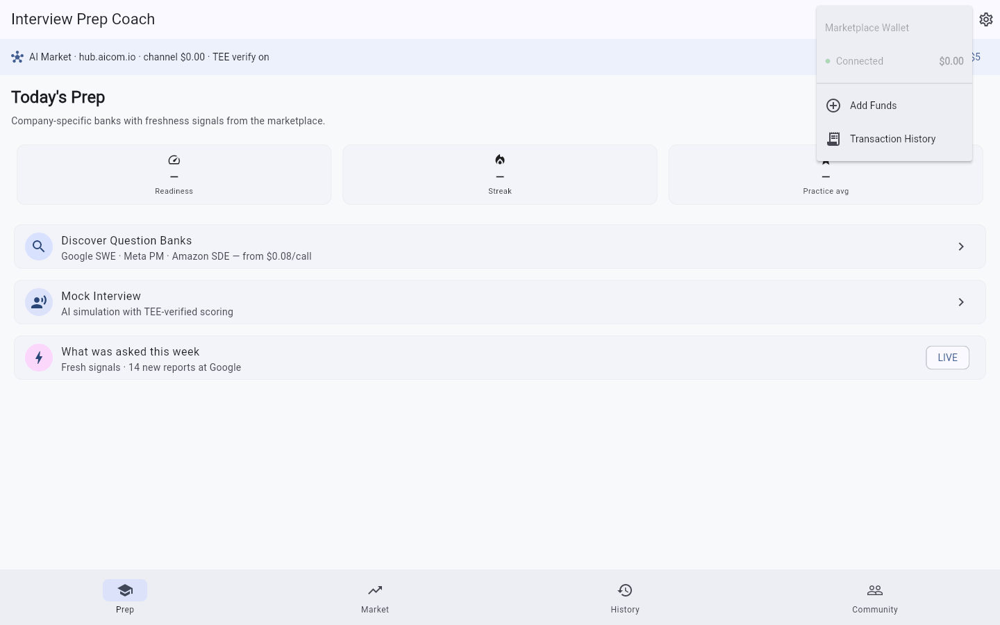
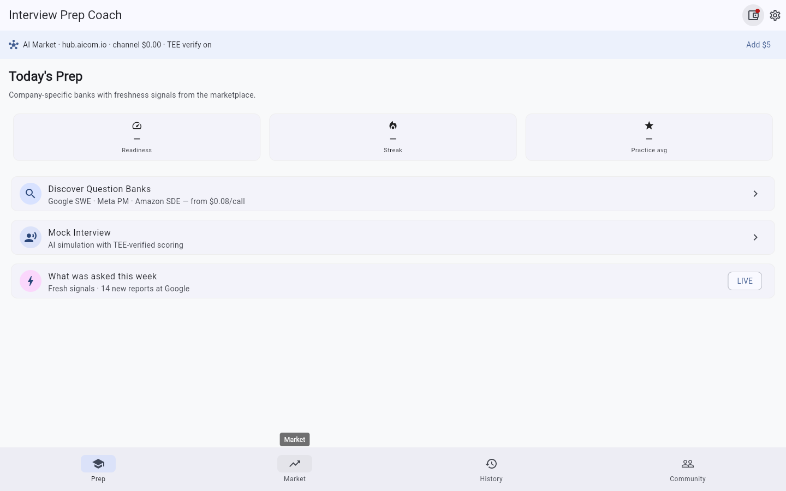
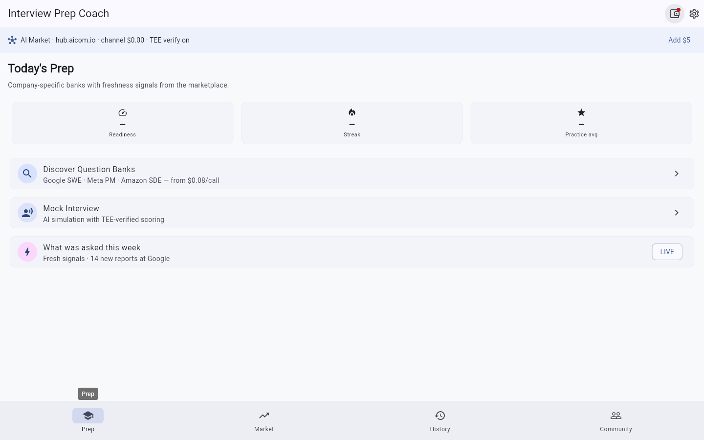
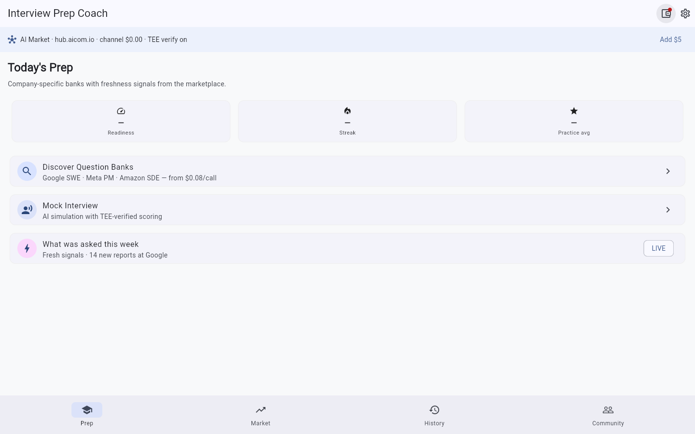

# Interview Prep Coach

> **Ecosystem:** [AICOM overview & live demos](https://modeldev.modelmarket.dev)

[](LICENSE)
[](https://flutter.dev)
[](https://github.com/alexar76/aimarket-sdks)

**Flutter desktop app** for interview preparation powered by the AI Market decentralized protocol. Access company-specific question banks, behavioral patterns, and real-time "what was asked this week" signals — all through an open marketplace economy.

## Promo video

Watch the product walkthrough (Playwright capture from factory pipeline):

- **Latest clip:** [`docs/gallery/promo-latest.webm`](../docs/gallery/promo-latest.webm) *(generated on shipped builds)*
- **Record locally:** `./scripts/run_web_demo.sh` then open Admin → Demo Storefront

## Screenshot gallery

| | | | |
|---|---|---|---|
|  |
|  |
|  |
|  |

Full gallery: **[assets/screenshots/](assets/screenshots/)**

Screenshots are captured during QA sign-off. Replace placeholders in `assets/screenshots/` with real captures from `./scripts/capture_screenshots.sh`.

---

## What It Does

Interview Prep Coach is a Tier 1 product that transforms interview preparation from static, stale content to a dynamic marketplace where:

- **Buy side**: Discover and purchase interview question banks tagged by company (e.g., `company:google`, `role:swe`), behavioral pattern packs, and real-time interview signals that update in days, not months.
- **Sell side**: Submit anonymized "question -> answer -> offer/reject" trajectories to earn marketplace credits. Your identity is never shared — only aggregated, sanitized patterns.
- **Practice**: AI-powered mock interviews that use purchased question banks, complete with real-time feedback and progress tracking.

### Freshness

Glassdoor and LeetCode discussion boards are months stale. The AI Market protocol updates in **days**. Questions reported this week are available this week. When interview patterns shift — new hiring bars, new question formats, new behavioral themes — the marketplace reflects it immediately.

### Privacy: Your Answers Never Leave Your Device

Interview answers are processed **entirely on-device**. When you sell a trajectory, the PII is stripped before anything leaves your machine:

- Candidate name, email, phone, LinkedIn URL removed.
- Company name hashed to a one-way identifier.
- Location reduced to broad region (US-West, EU-Central, APAC-South).
- Interviewer names discarded.

Only the question text, anonymized answer summary, and outcome are submitted. See `lib/src/services/marketplace_service.dart` for the client-side PII stripping implementation.

---

## Screenshots

| Prep Dashboard | Marketplace Browse | Mock Interview |
|---|---|---|
|  |  |  |

| Question Practice | Signal Feed | Wallet |
|---|---|---|
|  |  |  |

| Trajectory Submission | TEE Attestation | Bill of Materials |
|---|---|---|
|  |  |  |

Full gallery: **[assets/screenshots/](assets/screenshots/)**

---

## How It Uses the AI Market SDK

Interview Prep Coach is built on the `aimarket_agent` Dart SDK, which implements the AI Market Protocol v2 consumer cycle. Every marketplace interaction follows a 5-phase lifecycle:

### 1. Discovery: Find Interview Capabilities

```dart
import 'package:aimarket_agent/aimarket_agent.dart';

final agent = AimarketAgent(
  hubUrl: 'https://hub.aicom.io',
  walletKey: 'your-wallet-private-key-hex',
);

// Discover Google SWE behavioral question banks
final plan = await agent.discover(
  intent: 'Google SWE behavioral questions 2026',
  budget: 5.00,
  category: 'career',
);

// Discover real-time signals
final signals = await agent.discover(
  intent: 'recent interview questions asked at Google "what was asked this week" after:2026-05-01',
  budget: 2.00,
  category: 'career',
);
```

### 2. Open a Payment Channel

```dart
// Open a $5 channel — covers ~50 question bank calls at $0.10 each
final channel = await agent.openChannel(5.00);
```

### 3. Invoke: Purchase Interview Questions

```dart
final result = await agent.invoke(
  capabilityId: 'google-swe-q3-2026',  // from discovery
  input: {
    'target_role': 'Software Engineer',
    'years_experience': 4,
    'focus_areas': ['leadership', 'conflict_resolution'],
    'difficulty': 'medium',
  },
  channelId: channel.id,
  verifyTee: true,  // verify TEE attestation before sending
);

print('Questions: ${result.output}');
print('Cost: \$${result.priceUsd}');
print('TEE verified: ${result.teeVerified}');
```

### 4. Settle: Close Channel and Get Refund

```dart
final settlement = await agent.closeChannel(channel.id);
print('Spent: \$${settlement.totalSpentUsd}');
print('Refunded: \$${settlement.refundUsd}');
```

### 5. Verify: TEE Attestation

```dart
// Verify attestation before sending data
final verified = agent.verifyTeeAttestation(attestation, 'google-swe-q3-2026');

// Verify receipt after receiving output
final receiptVerified = agent.verifyTeeReceipt(receipt, sentInput, receivedOutput);
```

### Full Cycle with Bill of Materials

```dart
final bom = await agent.runOnce(
  intent: 'Google SWE behavioral questions 2026',
  input: {'target_role': 'Software Engineer', 'years_experience': 4},
  depositUsd: 5.00,
  category: 'career',
);

print('Total spent: \$${bom.totalSpentUsd}');
print('Settlement refund: \$${bom.settlement?.refundUsd}');
```

---

## Buy Side: What You Can Purchase

| Category | Example | Price | Update Cadence |
|---|---|---|---|
| Question Banks | `company:google role:swe` | $0.05-$0.50/call | Weekly |
| Behavioral Patterns | `amazon-leadership-principles-2026` | $0.10-$0.25/call | Bi-weekly |
| Real-Time Signals | `what-was-asked-google-swe` | $0.05-$0.15/call | Daily |
| System Design Packs | `design-instagram-google-swe` | $0.25-$1.00/call | Monthly |
| Mock Interview Sims | `mock-interview-google-swe-medium` | $0.50-$2.00/session | On-demand |

Capabilities are discovered via the marketplace's intent-based search, which matches your query against capability metadata tags (`company`, `role`, `category`, `difficulty`) and seller-provided descriptions.

---

## Sell Side: What You Can Earn

Submit anonymized interview trajectories to earn marketplace credits:

| Data Type | Typical Payout | Requirements |
|---|---|---|
| Question only | $0.01 | Question text + company |
| Question + answer | $0.05 | Question + how you answered |
| Full trajectory | $0.10-$0.25 | Question + answer + outcome (offer/rejection) |
| Verified trajectory | $0.50 | Full trajectory + offer letter verification (redacted) |

Payouts are in USDC on Base chain, deposited directly to your marketplace wallet.

---

## Architecture

```
┌─────────────────────────────────────────────────────┐
│              Interview Prep Coach                    │
│  ┌──────────────────────────────────────────────┐   │
│  │            Flutter Desktop App                │   │
│  │  ┌─────────┐ ┌──────────┐ ┌──────────────┐  │   │
│  │  │  Prep   │ │ Market   │ │  Settings    │  │   │
│  │  │  Tab    │ │  Tab     │ │  Tab         │  │   │
│  │  └────┬────┘ └────┬─────┘ └──────┬───────┘  │   │
│  │       │           │              │           │   │
│  │  ┌────▼───────────▼──────────────▼───────┐   │   │
│  │  │       MarketplaceService               │   │   │
│  │  │  (wraps AimarketAgent)                 │   │   │
│  │  └────────────────┬───────────────────────┘   │   │
│  └───────────────────┼───────────────────────────┘   │
│                      │                               │
│  ┌───────────────────┼───────────────────────────┐   │
│  │        aimarket_agent Dart SDK                 │   │
│  │  Discover │ Channel │ Invoke │ Settle │ Verify │   │
│  └───────────────────┼───────────────────────────┘   │
└──────────────────────┼───────────────────────────────┘
                       │ HTTP / WebSocket
              ┌────────▼────────┐
              │  AI Market Hub  │
              │ (hub.aicom.io)  │
              └─────────────────┘
```

For detailed architecture documentation, see [docs/architecture.md](docs/architecture.md).

---

## Getting Started

### Prerequisites

- Flutter SDK 3.11+ with desktop support
- Dart SDK 3.11+
- A wallet for the AI Market (created during first-launch wizard)

### Run from Source

```bash
# Clone the desktop monorepo (this app lives in apps/interview-prep-coach)
git clone https://github.com/alexar76/aimarket-desktop.git
cd aimarket-desktop/apps/interview-prep-coach

# Get dependencies
flutter pub get

# Run (Linux)
flutter run -d linux

# Run (macOS)
flutter run -d macos

# Run (Windows)
flutter run -d windows
```

### First Launch

1. **Welcome** screen explains the marketplace model and privacy guarantees.
2. **Wallet setup** creates or imports your marketplace wallet.
3. **Target selection** sets your target company and role.
4. You're ready to discover question banks and start practicing.

---

## Directory Structure

```
interview-prep-coach/
├── lib/
│   ├── main.dart                          # App entry point
│   ├── src/
│   │   ├── app.dart                       # App bootstrap
│   │   ├── models/
│   │   │   └── interview_question.dart    # Question & trajectory models
│   │   ├── screens/
│   │   │   ├── shell_screen.dart          # Main navigation shell
│   │   │   └── wizard/
│   │   │       └── setup_wizard_screen.dart # First-launch wizard
│   │   ├── services/
│   │   │   ├── marketplace_service.dart   # Marketplace integration
│   │   │   └── wallet_service.dart        # Wallet management
│   │   ├── state/
│   │   │   └── app_state.dart             # App state management
│   │   ├── theme/
│   │   │   └── app_theme.dart             # Material 3 theme
│   │   └── widgets/
│   │       └── marketplace_status_bar.dart # Wallet status indicator
├── assets/
│   ├── branding/                          # App icons
│   └── screenshots/                       # Screenshot gallery
├── docs/
│   ├── architecture.md                    # Architecture documentation
│   ├── user-cases.md                      # Detailed user cases
│   └── sdk-integration.md                 # SDK integration examples
├── test/                                  # Unit and widget tests
├── linux/                                 # Linux desktop support
├── macos/                                 # macOS desktop support
├── windows/                               # Windows desktop support
├── pubspec.yaml                           # Flutter dependencies
└── README.md                              # This file
```

---

## Documentation

| Document | Description |
|---|---|
| [docs/architecture.md](docs/architecture.md) | App architecture, 5-phase marketplace cycle, TEE verification |
| [docs/user-cases.md](docs/user-cases.md) | Three detailed user cases (job seeker, career coach, HR platform) |
| [docs/sdk-integration.md](docs/sdk-integration.md) | Concrete Dart code examples for SDK integration |
| [assets/screenshots/README.md](assets/screenshots/README.md) | Screenshot gallery description and guidelines |

---

## Contributing

See [CONTRIBUTING.md](CONTRIBUTING.md) for development setup and pull request guidelines.

## Security

See [SECURITY.md](SECURITY.md) for vulnerability reporting.

## License

MIT — see [LICENSE](LICENSE).
