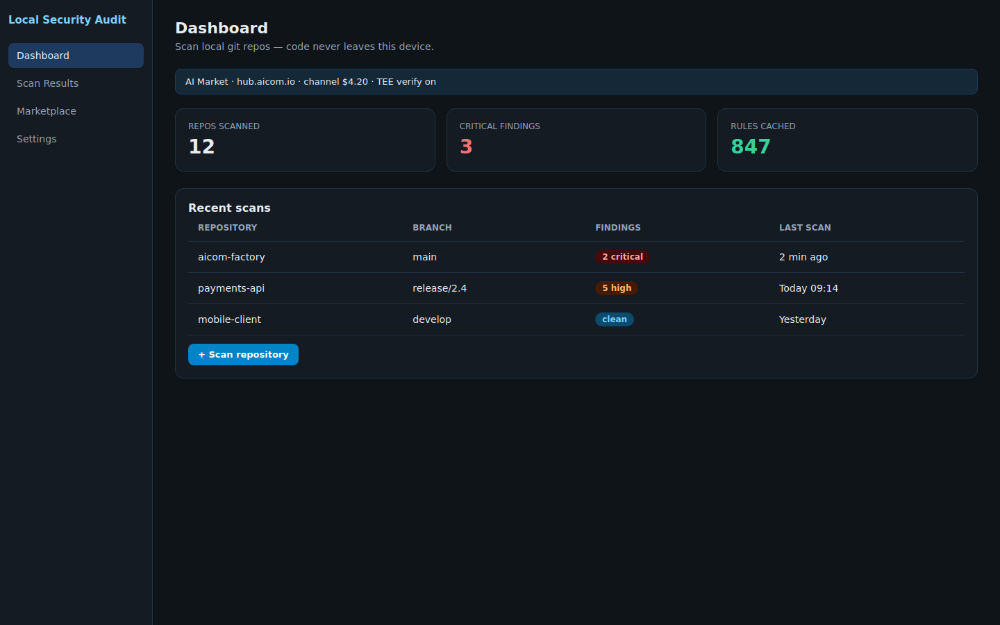
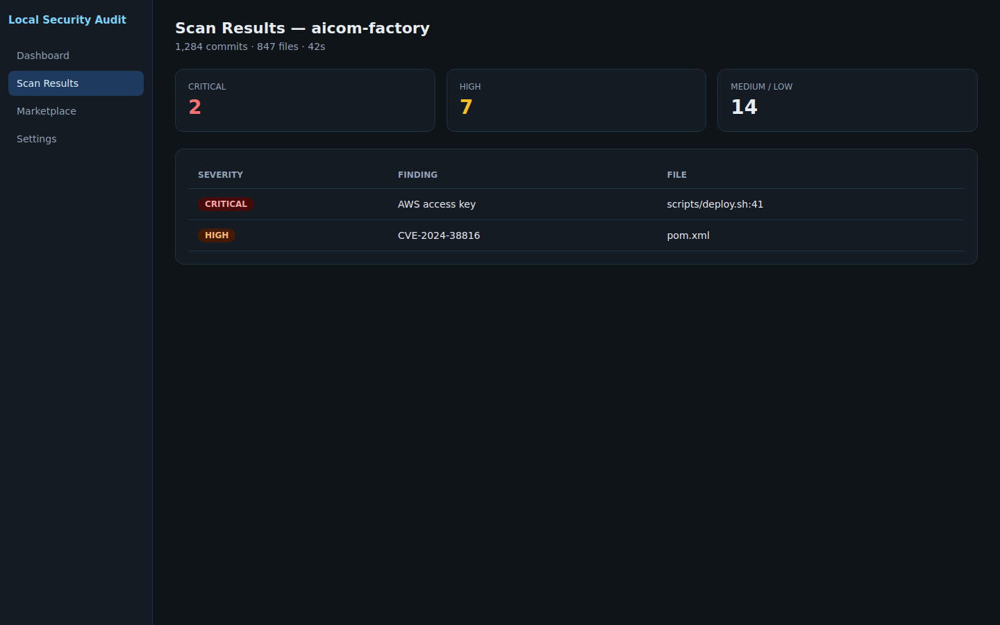
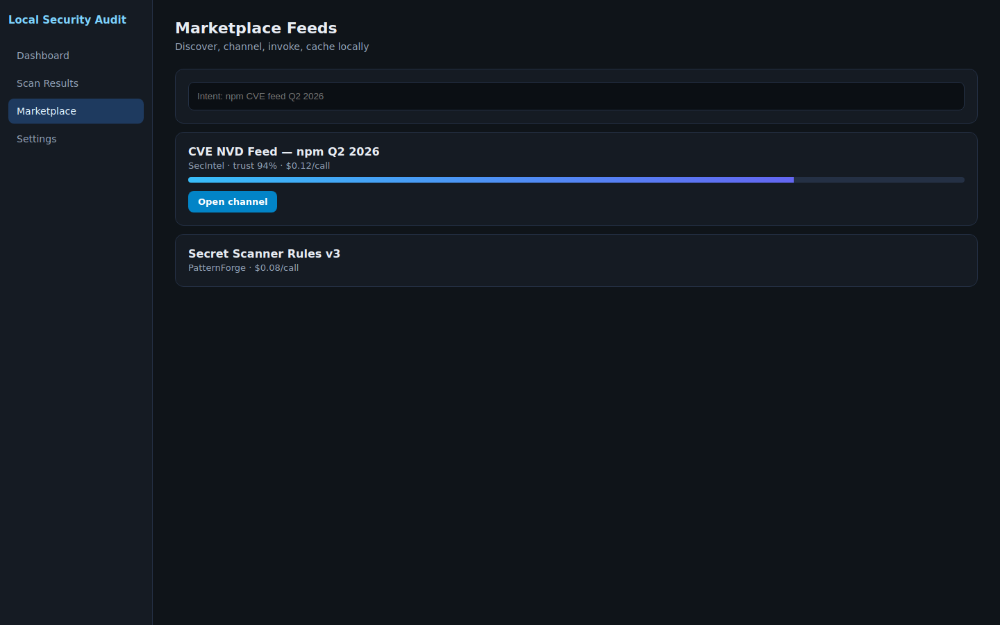
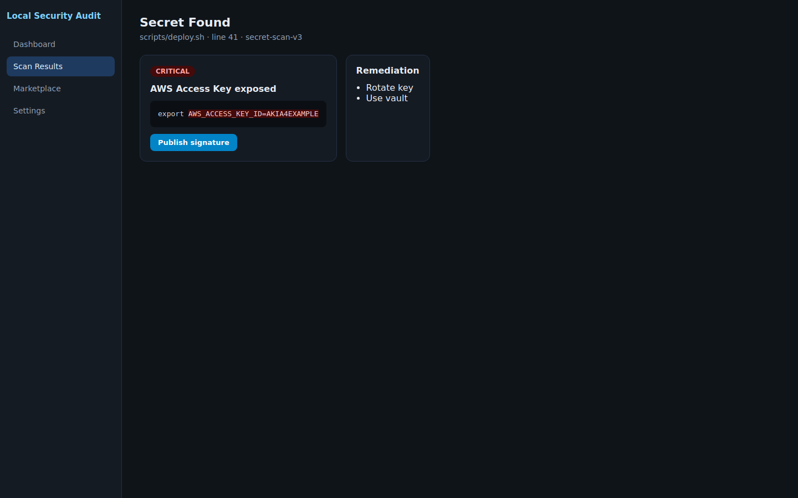
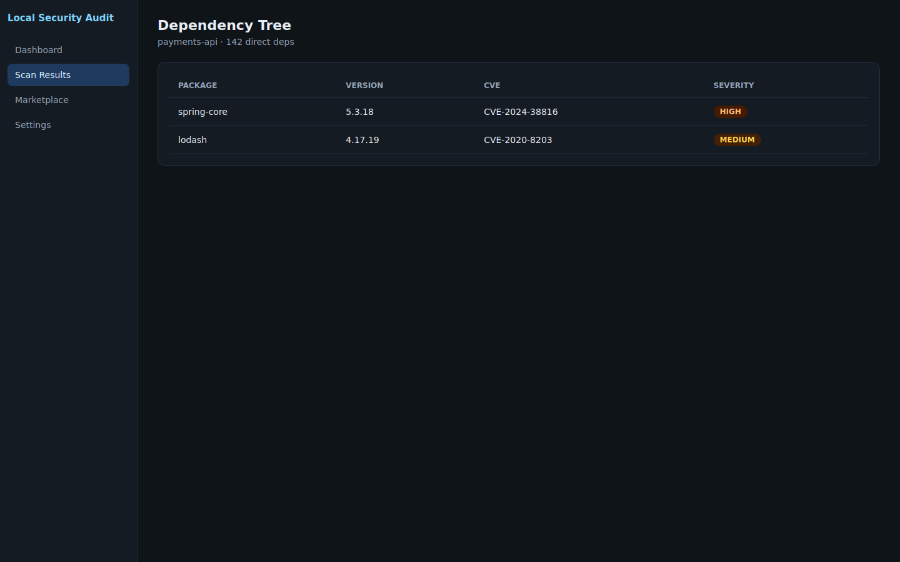
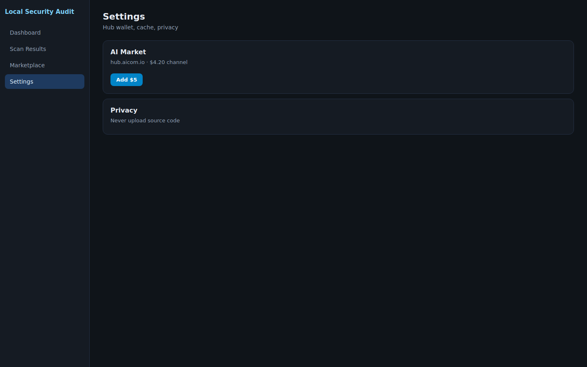

# Local Security Audit

[](LICENSE)

**Tauri desktop app** — scan your local git repositories for secrets, vulnerable dependencies, and anti-patterns. Your code never leaves your machine.

## Why Local Security Audit?

| | Local Security Audit | Snyk | GitGuardian |
|---|---|---|---|
| **Code leaves device** | Never. Only signature hashes. | Uploads manifests | Uploads git history |
| **Pricing** | Pay-per-scan or marketplace subscriptions | Per-seat SaaS | Per-seat SaaS |
| **Rule freshness** | Marketplace-bought feeds | Vendor-managed | Vendor-managed |
| **Offline capable** | Yes (with cached rules) | No | No |
| **Sell findings** | Anti-pattern signatures (no code) | No | No |

## How it works

1. **Pick a repo** — scan any local git repo by path.
2. **Fetch fresh rules** — buy CVE feeds, exploit DB updates, and secret-scanning rules from the marketplace. Each purchase is verified via TEE attestation.
3. **Scan locally** — the engine runs entirely on-device. Secrets, vulnerable patterns, and dependency issues are flagged without ever sending a byte of your code.
4. **Review results** — a structured report grouped by severity (critical, high, medium, low).
5. **Sell signatures** — anonymized anti-pattern signatures found in your repos can be listed on the marketplace for other teams (no code, only signature hashes).

## Screenshots

| Dashboard | Scan Results | Marketplace Feeds |
|-----------|-------------|-------------------|
|  |  |  |

| Secret Found | Dependency Tree | Settings |
|-------------|----------------|----------|
|  |  |  |

Full gallery: **[docs/screens/](docs/screens/)**

## Documentation

- **[docs/architecture.md](docs/architecture.md)** — Tauri desktop architecture, Rust SDK integration, privacy guarantees
- **[docs/user-cases.md](docs/user-cases.md)** — Three real-world scenarios
- **[docs/sdk-integration.md](docs/sdk-integration.md)** — Rust `aimarket-agent` SDK usage with code examples

## Features

- **Local git scanner** — parses commit history, HEAD state, `.git/config`, dependency manifests
- **Marketplace rule engine** — discover, purchase, and cache CVE feeds, exploit DB patterns, and secret-detection rules
- **TEE-verified accuracy** — each marketplace purchase includes a TEE attestation proving the rule runs in a verified enclave
- **Anti-pattern detection** — flags hardcoded credentials, insecure crypto usage, dependency confusion, and more
- **Signature marketplace** — contribute anonymized findings as signature hashes only (no source code exposure)
- **Offline mode** — scan with cached rules when disconnected
- **Export reports** — JSON, HTML, or SARIF

## Quick start

```bash
# Clone and build
git clone https://github.com/your-org/local-security-audit.git
cd local-security-audit

# Run in development mode
cargo tauri dev
```

## Build for production

```bash
cargo tauri build
```

Binaries are published on **[GitHub Releases](https://github.com/your-org/local-security-audit/releases)**:

| Platform | File |
|----------|------|
| macOS | `LocalSecurityAudit-vX.Y.Z-macos.zip` |
| Windows | `LocalSecurityAudit-vX.Y.Z-windows-x64.zip` |
| Linux | `LocalSecurityAudit-vX.Y.Z-linux-amd64.deb` |

## Architecture at a glance

```
┌──────────────────────────────┐
│   Tauri Desktop Shell        │
│  ┌────────────────────────┐  │
│  │  Frontend (React/Vue)  │  │
│  └──────┬─────────────────┘  │
│         │ IPC                 │
│  ┌──────▼─────────────────┐  │
│  │  Rust Backend           │  │
│  │  ┌──────────────────┐   │  │
│  │  │ Git Scanner       │   │  │
│  │  ├──────────────────┤   │  │
│  │  │ Rule Engine       │   │  │
│  │  ├──────────────────┤   │  │
│  │  │ Marketplace SDK   │   │  │
│  │  │ (aimarket-agent)  │   │  │
│  │  └──────────────────┘   │  │
│  └─────────────────────────┘  │
└──────────────────────────────┘
```

## Contributing & security

- [CONTRIBUTING.md](CONTRIBUTING.md) — development and pull requests
- [SECURITY.md](SECURITY.md) — report vulnerabilities confidentially
- [LICENSE](LICENSE) — MIT

## License

MIT — see [LICENSE](LICENSE).
