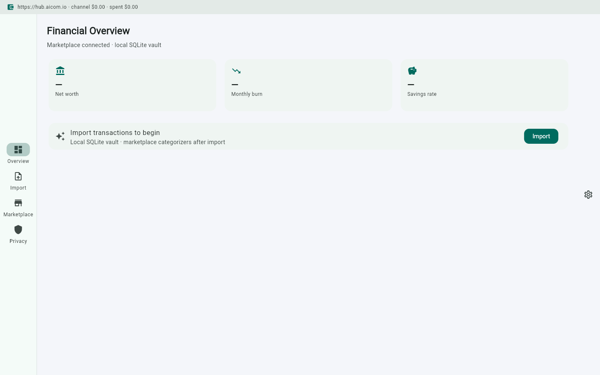
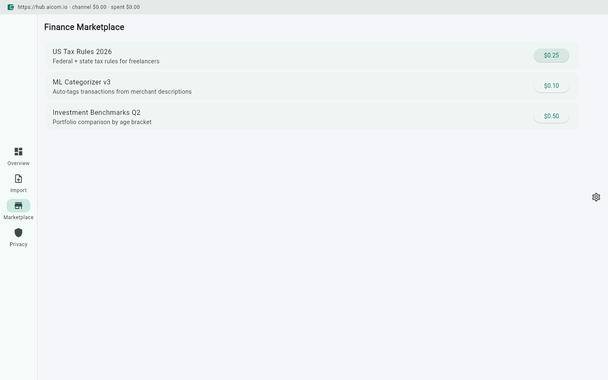
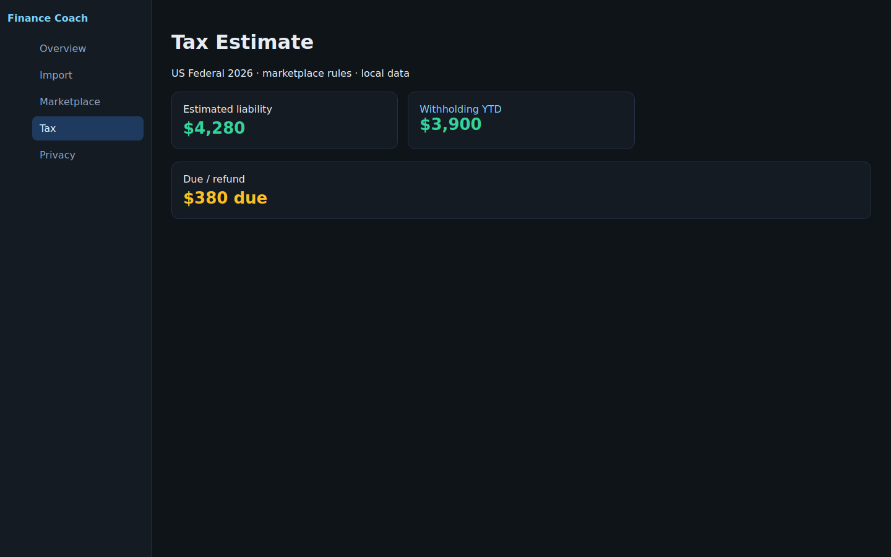

# Personal Finance Coach

> **Ecosystem:** [AICOM overview & live demos](https://alexar76.github.io/aicom/)


**Local-first financial intelligence. Your bank statements never leave your machine.**

## Value in plain words

Your bank data stays on your machine — not in someone else's cloud — while you still use smart categorization and tax rules bought from the marketplace. You keep privacy and get AI help with money.

**Простыми словами:** Данные банка остаются на вашем компьютере — не в чужом облаке — а умные категории и налоговые правила вы покупаете на маркетплейсе. Приватность сохраняется, помощь с деньгами — тоже.

Full text: [docs/value.md](docs/value.md)


## Why

Mint died because the SaaS model couldn't handle bank data. Every personal finance SaaS faces the same problem: users don't trust cloud with their statements.

The fix: **local parsing + marketplace of rules**. Parse CSVs on-device. Buy tax rules, categorizers, and benchmarks from the marketplace. Sell anonymized cohort patterns (with zk-proof).

## How It Uses AIMarket

### Buy Side
| Capability | Price | Freshness |
|---|---|---|
| Tax rules by jurisdiction (US/CA/EU) | $0.25 | Updated yearly |
| Transaction categorizers (ML-based) | $0.10 | Updated monthly |
| Investment benchmarks | $0.50 | Updated quarterly |
| Spending anomaly detection | $0.15 | Real-time |

### Sell Side
- **Anonymized cohort spending patterns** — "users in 30-35 age bracket in Berlin spend 28% on rent" (zk-proof that you're in the cohort, without revealing your data)
- **Category mapping improvements** — "this merchant description maps to 'groceries' not 'restaurant'"

### Killer Feature
Tax rules decay yearly. No single SaaS covers all jurisdictions well. Marketplace: one tax expert maintains `us-tax-rules-2026`, all finance coaches buy it.

## Privacy Guarantee

```
┌──────────────────────────────────────┐
│  Your Machine (ONLY)                 │
│                                      │
│  bank-statements.csv ──► Parser      │
│                            │         │
│                            ▼         │
│                      Local SQLite    │
│                            │         │
│              ┌─────────────┼────┐    │
│              ▼             ▼    ▼    │
│         Categorizer    Budget  Tax  │
│         (local run)    calc    est  │
│              │                       │
│   Marketplace│ rules flow IN         │
│   ◄──────────┼───────────────────   │
│              │                       │
│   Anonymized│ patterns flow OUT     │
│   ──────────┼───────────────────►   │
│   (with zk-proof)                    │
└──────────────────────────────────────┘
```

## Screenshot Gallery

| Screen | Description |
|---|---|
|  | Main dashboard with spending overview, budget rings, and marketplace status |
|  | Bank CSV import with auto-detection of column mapping |
|  | Marketplace tab showing tax rules, categorizers, benchmarks |
|  | Tax estimation with jurisdiction-specific rules from marketplace |
|  | Privacy dashboard showing what data stays local vs what's shared |

## Tech Stack

- **Flutter** desktop (macOS/Windows/Linux)
- **SQLite** for local data (via `sqflite_common_ffi`)
- **aimarket_agent** Dart SDK for marketplace integration
- **csv** parser for bank statements
- **zk-proof** verification via TEE plugin

## Integration Example

```dart
import 'package:aimarket_agent/aimarket_agent.dart';

class FinanceMarketplaceService {
  final AimarketAgent _agent;

  FinanceMarketplaceService({required String walletKey})
      : _agent = AimarketAgent(
          hubUrl: 'https://hub.aicom.io',
          walletKey: walletKey,
        );

  /// Buy fresh tax rules for the user's jurisdiction.
  Future<Map<String, dynamic>> refreshTaxRules(String jurisdiction) async {
    final bom = await _agent.runOnce(
      intent: 'tax rules for $jurisdiction 2026',
      input: {'jurisdiction': jurisdiction},
      category: 'fintech',
    );
    return bom.results.first.output ?? {};
  }

  /// Sell anonymized spending pattern (with zk-proof).
  Future<void> publishCohortPattern(Map<String, dynamic> pattern) async {
    final channel = await _agent.openChannel(1.00);
    await _agent.invoke(
      capabilityId: 'publish-cohort-pattern',
      input: {
        'pattern': pattern,
        'zk_proof': pattern['proof'], // generated locally
      },
      channelId: channel.id,
    );
    await _agent.closeChannel(channel.id);
    _agent.dispose();
  }
}
```

## Getting Started

```bash
git clone https://github.com/alexar76/personal-finance-coach
cd personal-finance-coach
flutter pub get
flutter run -d macos
```

Then:
1. Import a bank CSV (Settings → Import)
2. Configure your jurisdiction for tax rules
3. Open Marketplace tab → buy tax rules for $0.25
4. Review categorized transactions
5. Opt-in to share anonymized patterns (earns credits)
