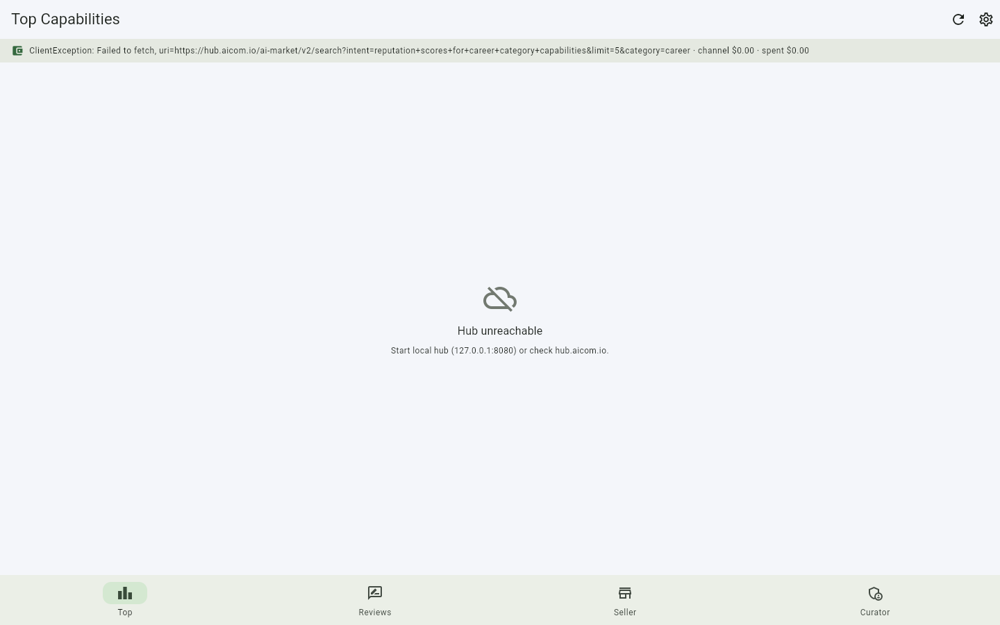
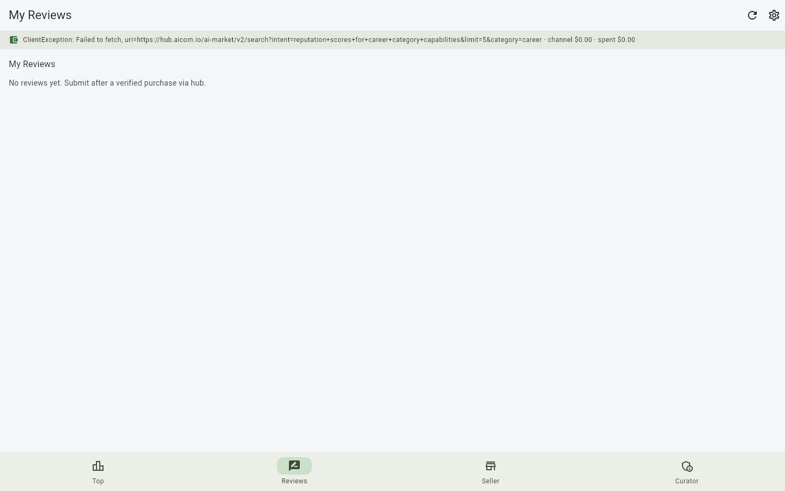
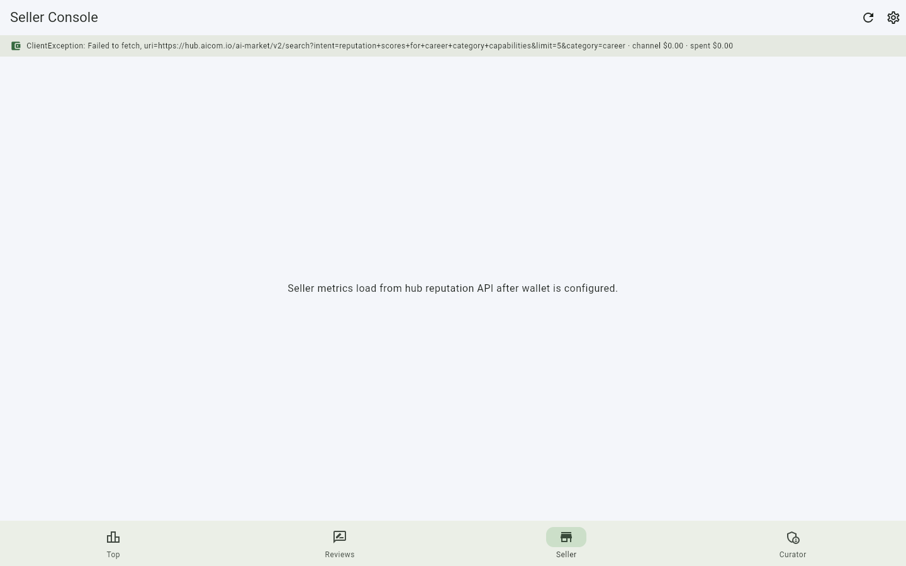
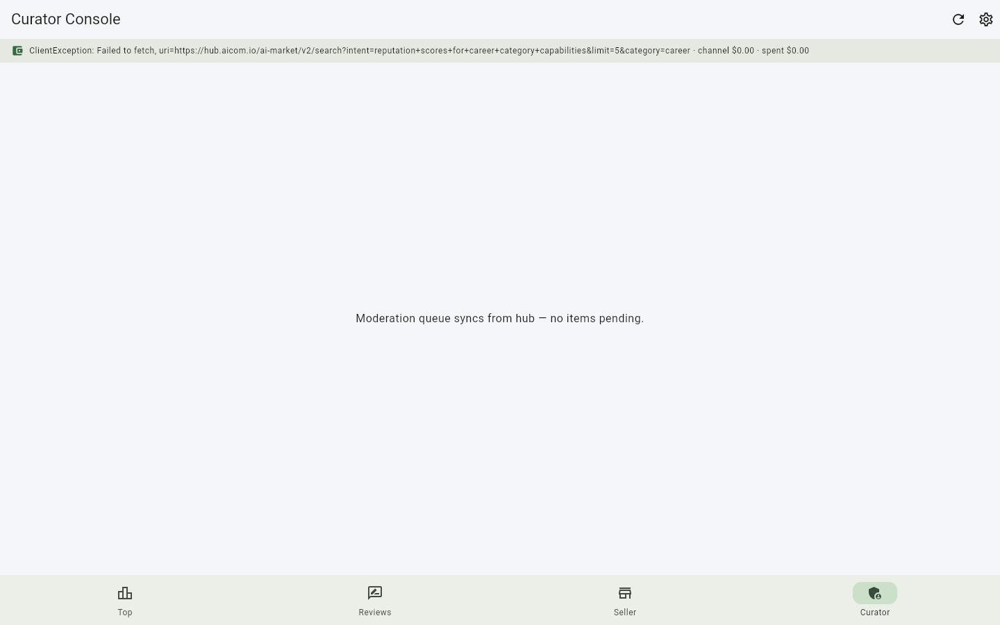

# Reputation Dashboard

> **Ecosystem:** [AICOM overview & live demos](https://modeldev.modelmarket.dev)

**Tier 5 Meta-Product — "Yelp for aimarket"**

A Flutter desktop application (macOS / Windows / Linux) that brings transparency to the AI
Marketplace. Users see honest, verified ratings and reviews for every capability they have
purchased, aggregated from on-chain reputation events recorded by the `reputation` plugin.

## Promo video

Watch the product walkthrough (Playwright capture from factory pipeline):

- **Latest clip:** _promo clip is generated on shipped builds_
- **Record locally:** `./scripts/run_web_demo.sh` then open Admin → Demo Storefront

## Screenshot gallery

| | | | |
|---|---|---|---|
|  |
|  |
|  |
|  |

Full gallery: **[assets/screenshots/](assets/screenshots/)**

Screenshots: `python3 ../../scripts/capture_desktop_screenshots.py reputation-dashboard`

---

## Why This Exists

Without a trust layer, a decentralized marketplace cannot grow. Buyers have no way to
distinguish high-quality capabilities from noise. Sellers lack a signal that rewards quality.
The Reputation Dashboard solves both problems by surfacing **aggregated, tamper-evident
reputation data** directly from the hub.

---

## Features

- **Verified Reviews** — Every rating and review is anchored to a real purchase and a real
  wallet identity. No bots, no fake reviews.
- **Category-Level Aggregates** — See the top 10 capabilities in any category (career,
  devops, analyst, sales, qa, hardening, hub).
- **Trust Score Visualizations** — Per-capability and per-seller trust scores with
  historical trends.
- **Multi-Chain** — Reputation data across Ethereum, Polygon, BSC, Avalanche, and
  Fantom in a single unified view.
- **Marketplace SDK Integration** — The dashboard is itself an aimarket consumer: it uses
  `AimarketAgent` to fetch reputation events and submit new reviews.

---

## Getting Started

### Prerequisites

- Flutter SDK 3.24+
- Dart SDK 3.2+
- A funded wallet key for the AI Market hub

### Install

```bash
git clone https://github.com/alexar76/aimarket-desktop.git
cd aimarket-desktop/apps/reputation-dashboard
flutter pub get
```

### Configure

Create a `.env` file or pass environment variables at launch:

```
HUB_URL=https://hub.aicom.io
WALLET_KEY=your-private-key-hex
```

### Run

```bash
flutter run -d macos    # macOS
flutter run -d linux    # Linux
flutter run -d windows  # Windows
```

---

## Architecture

See [docs/architecture.md](docs/architecture.md) for the full data flow, aggregation
pipeline, and SDK integration points.

---

## User Scenarios

See [docs/user-cases.md](docs/user-cases.md) for detailed walkthroughs of the three
primary personas: buyer, seller, and marketplace curator.

---

## SDK Integration

See [docs/sdk-integration.md](docs/sdk-integration.md) for code examples showing how
the dashboard programmatically discovers and submits reputation events.

---

## License

MIT — see LICENSE.
